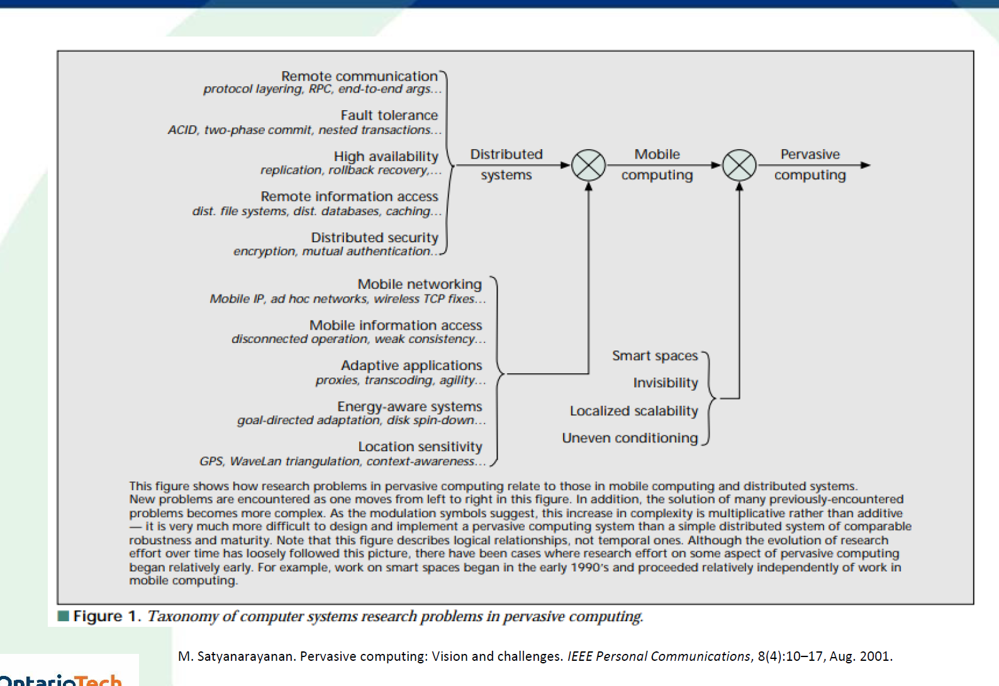

### Learning Outcomes
- NS-3 simulator network testing.
- 4 in-class activities with no make-up
- 20% Project will be at the end of the course. 
- Midterm is Monday July 14
	- Mix of MCQ and Short answer
	- Midterm will come from lecture notes covered in class.

With pervasive computing and mobility, they are interconnected. Distributed system, IOT, mobility, and pervasive. All of these terms are somehow connected. So what are the differences between those terms?
- Mobility lets us use mobility devices that we can use when we are on the move. 
	- Cell phones
- On the other hand, in pervasive computing we can use embedded computing in devices and those devices can connect to every day environments and objects.
	- Eg. smart watches that contain some electric circuits, computing devices, small memory/processor to do certain tasks by connecting to objects and the environment.
		- Eg. measuring heartbeat, environmental conditions, etc.
	- The difference between cell phone and smart watches are completely different. The structure and protocols used for these devices are vastly different. 
		- Eg. the structure, power consumption requirements, etc.
	- This course will focus on pervasive computing.
- Ubiquitous applications are those we can use everywhere. 
	- There are four groups of these components.
		- human-computer
		- human-physical
		- computer-physical
		- check notes
	- Why these categories? 
		- The design/interface will be different for each category. 
		- Will have their own special architecture and protocols for each type.
- HCI - Human computer interaction
	- Is when a human interacts with a computing system. The human directly interfaces with these devices to perform tasks.
		- Eg. smartphones, voice assistants, web browsers, ATM machines, self-service kiosks.
	- UI/UX design comes into play here to ensure good user experience takes place.
	- Out of millions of apps, only 2.5% of all apps in the app store is successful.
- Human Physical World Interaction
	- Interaction where humans interact with physical world mediated by sensors or augmented tech.
		- Augment reality AR apps, fitness trackers, smart glasses, gesture-controlled devices, contactless payment systems.
- Human to human interaction
- Computer to physical world interaction where computers can interact with the physical world.
	- Smart thermostats, robotic vacuum cleaners, industrial automation systems, smart irrigation systems, home security systems
- CCI
	- Backbone that supports communication. 
	- There is GSM and wireless telecom networks (Global system for mobile networks) 1G, 2G, 3G, 4G, 5G. Each G stands for the variations of GSM protocol that handles wireless communication.
		- In the past there was no cellular network via GSM. It was all wired connection. 
		- The first GSM was just for sending and receiving voice. No messages. Then G1, G2, etc. came into play.
		- With 5G, we can send massive amounts of data over the network. The bandwidth has been expanded significantly. So we can deal with applications that require this level of bandwidth.
	- TCP/IP-based wireless access networks
		- It is a protocol.
			- A protocol is how devices communicate over the internet and other networks. 
			- In real life, the protocol for people meeting for the first time is a handshake.
			- A protocol is a set of rules to ensure two or more devices are sending and receiving information correctly. In TCP/IP it is IP based.
				- Messages will travel over TCP/IP based protocol.
				- There will be handshakes to ensure a proper channel is created to transmit data over that line.
		- A very practical and widely (mostly) used protocol.
		- Used for secure applications.
	- Satellite networks including Global Positioning System (GPS) networks
		- Google maps
		- Satellite internet that can be accessed in the middle of nowhere
			- Starlink
	- One protocol cannot handle all devices. Each one requires a certain type of protocol. 
		-    Eg. transferring data from sensor to server may require a very light protocol. It may not even require much security. An electric car on the other hand might require a very stringent and heavy duty protocol.
			- Light protocol means it won't cost a lot in terms of computation and bandwidth, and other resources.
	- CCI: computer communication interface
	- There are many protocols under the hood when performing various operations such as sharing files.
		- Security
		- Storage
		- Type of content
		- Interface
		- Permissions
		- Tracking
		- Architecture/Medium (cloud, multiple servers)
		- Distributed systems (Accessed from anywhere in the world)
	- When music is playing on the phone and a call comes in, there is communication between applications to pause the music and prioritize the call until the call ends.
	- Another example might be google maps taking over voice/audio/notification on the device.
		- This means there is a sort of communication between services over one device.
	- Therefore, pervasive device applications can be connected to each other in a lot of ways.
- If you have a powerful application but the UI/UX interaction is very poor, the application is likely not to perform well.
- In some applications we have universal local control. For example, these days we have smart home monitors to access lights, TV, appliances, etc. using one control.
	- Has advantages and disadvantages
		- Can handle everything via one control/device/interface.
		- If control is damaged/out of service can't access any of the items.
		- Interference if there are multiple controls in one room where they may not sync up on time, or if both are adjusted at the same time, which one takes priority?
	- ICT is short for Information and Communication Technology.
- HPI and CPI
	- Eg. we walk into a room and the light dims.
	- How smart devices interact with people and vice versa.
- Smart devices are those that can be controlled by various protocols. 
- Context awareness and service discovery
	- Device is aware of the current situation.
	- Eg. a website layout that changes based on location the website is visited from.
- The two main issues with wearable devices (smart watch, smart glasses, etc.)
	- Temperature (watches for eg. are attached to the skin for 24h and can lead to skin cancer due to heat via the battery which releases heat)
	- Interference. Eg. a smart watch could interfere with an implant attached to the body.
- Pervasive technologies can be used everywhere. Eg. smart watches, laptops, phones
	- Not confined to a certain location like a desktop computer.
	- Prof said that the phone itself might not be considered pervasive, but the technology or app within might be.
- Ubiquitous means technology is hidden. Eg. pace maker embedded within the body. Once it is turned on, you don't have direct control over it as it will work without your intention.
- 1991 was the important part about History. The rest prof doesn't care about when it comes to the history.
- Pervasive computing has been around for a very long time. Since the 70's.

- Above is not addition. It is multiplexer (I think this means that out of all the items listed above, it could include multiple elements but not all by the time it gets to pervasive computing)
- Distributed systems consist of multiple interconnected devices or nodes working collaboratively to perform complex tasks, offering scalability, fault tolerance, and speed for applications like e-commerce, video rendering, and scientific computing.
- Mainframe: large computer that manages all server information. Multiple users can connect to it to perform CRUD operations etc.
	- Dummy terminals were monitors that had keyboard and mouse that would plug into the network via network cable. Once it connects to the server the commandlet cmd could be used to pull info from the server. 
		- Had a lot more disadvantages than advantages. Eg. if server dies everyone loses access.
	- Mainly centralized
	- Cannot use service when provider is off
- Personal computer was the next stage: Shared the power of computational processes.
- Pervasive computing era: Recent and future advancements.
	- Have processors, memory, and are equal or more capable than personal computers.
	- More computational power on the go.
	- Decentralized
	- Can use service while provider is off. Eg. Google maps
- Heterogeneous Networks
	- Networks from different network structures, protocols, or concepts
- End-point application deployment
	- Edge computing 
		- Eg. sensors in a farm. These sensors are placed in a way that temp of soil, level of humidity, etc. is sensed and readings are handled by local server to provide solution for increased productivity and control
		- Not the same as cloud computing. Just serves a specific part of computational service.
- Unpredictable variation in network quality
	- Eg. if there isn't enough bandwidth available at times for the requirement of the device being used in that area.
- Lowered trust and robustness of mobile elements
	- In the past people were very against changes in technology, but over time the sentiment has been changing towards embracing new tech.
- Concern for battery power consumption
	- Apple watch may only stay charged for 1 day
	- Some new watches might last for one to two weeks
	- Electric cars are limited by availability of charge
- Smart environment meaning interconnected devices, sensors, etc.
	- All facilities required to implement smart application is available.
- 