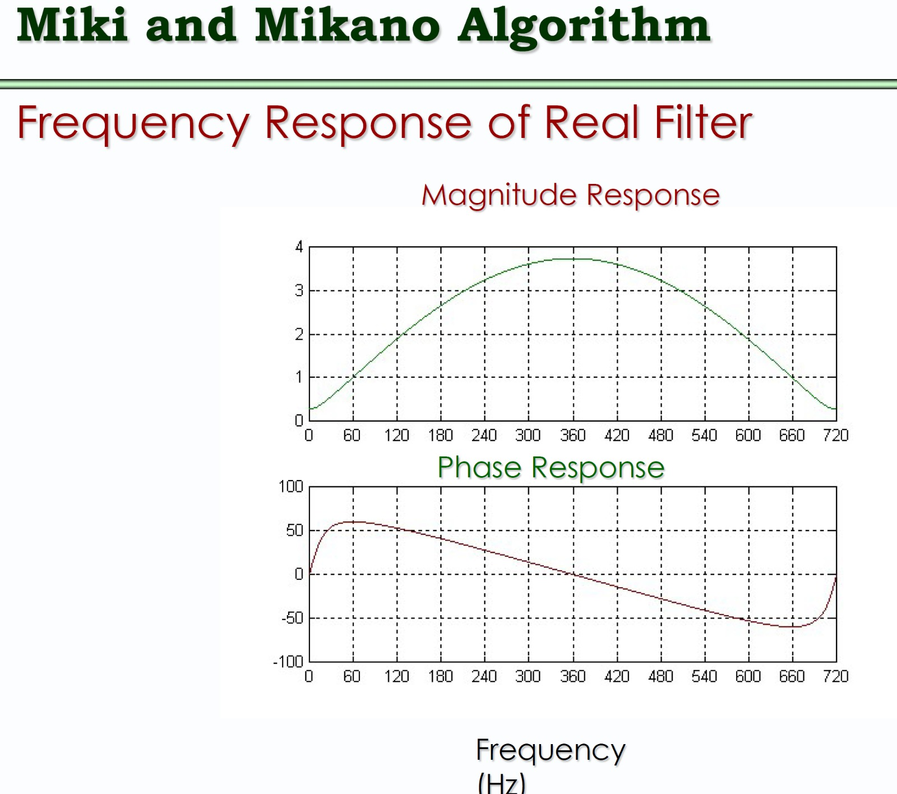
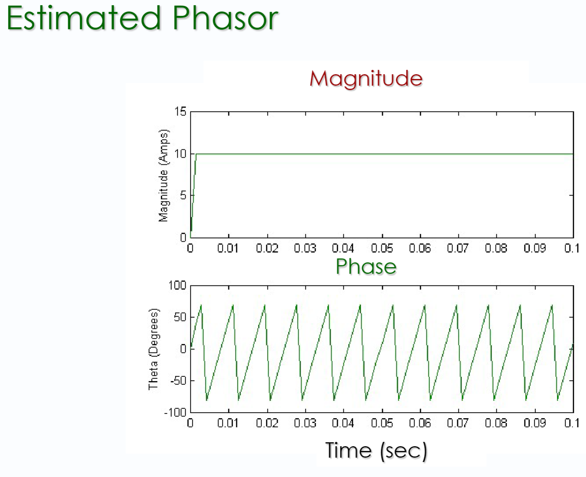

### Expected Plot From Lecture



### Plot From Code


### Reminder to improve this code so that we're finding frequency response for both real and imaginary parts. This filter currently only accounts for the real part.

```
fs = 720; % Sampling frequency

T = 1 / fs; % Sampling period

f = linspace(0, fs, 1000); % Frequency range for plotting

omega = 2 * pi * f * T; % Discrete angular frequency (radians/sample)

% Evaluate H(z) = 1.732*z - 2*z^(-1) on the unit circle (z = exp(j*omega))

z = exp(1j * omega);

H = 1.732 * z.^(0) - 2 * z.^(-1); % Equivalent to 1.732*z - 2*z^(-1)

% Get magnitude and unwrapped phase

mag = abs(H);

phi = unwrap(angle(H)) * 180 / pi;

% Plot

figure;

% ✅ Correct phase so it starts and ends at 0 degrees

phi_start = phi(1);

phi_end = phi(end);

phi_baseline = linspace(phi_start, phi_end, length(phi));

phi_corrected = phi_baseline - phi;

subplot(2,1,1);

plot(f, mag, 'b', 'LineWidth', 2);

xlabel('Frequency (Hz)');

ylabel('Magnitude');

title('Magnitude Response');

grid on;

xticks(0:60:720) % <- this sets tick labels every 60 Hz

subplot(2,1,2);

plot(f, phi_corrected, 'r', 'LineWidth', 2);

xlabel('Frequency (Hz)');

ylabel('Phase (degrees)');

title('Corrected Phase Response');

grid on;

xticks(0:60:720) % <- this sets tick labels every 60 Hz

ylim([-180 180]); % Sets y-axis range from 0 to 100 degrees
```

### Going back to pure sine wave (first lecture example). Modeled by directly plugging in magnitude and phase eqn from lecture notes instead of using FIR filter. I also added a phase shift of pi/12 to get the sin wave starting/ending at the same spot as lecture example.




### This plot is zoomed in [-100, 100] to match lecture notes.


### Scaled to 180 deg as recommended by prof [-180, 180]


```
% Parameters

fs = 720; % Sampling frequency (Hz)

T = 1 / fs; % Sampling period (s)

t = 0:T:0.1; % Time vector (0.1 seconds)

f0 = 60; % Signal frequency (Hz)

Vm = 10; % Amplitude

omega = 2 * pi * f0; % Angular frequency

% Generate 60 Hz sine wave input

x = Vm * sin(omega * t + pi/12); % Input waveform

% Allocate arrays

angle_deg = zeros(1, length(t)-1);

mag = zeros(1, length(t)-1);

% Apply the 2-sample phasor magnitude and angle estimator

for n = 2:length(t)

V0 = x(n); % Current sample

V1 = x(n-1); % Previous sample

num = V0;

den = (V0 * cos(omega*T) - V1) / sin(omega*T);

angle_deg(n-1) = atan(num / den) * 180/pi;

mag(n-1) = sqrt(V0^2 + den^2); % 2-sample magnitude

end

% Pad to align with time vector

angle_deg = [angle_deg(1), angle_deg];

mag = [0, mag]; % Start magnitude at zero

angle_deg(1) = 0; % Set the initial angle to 0 so that it doesn't start randomly on the y axis

% Plot: Input and Phase Angle

figure;

subplot(2,1,1);

plot(t, mag, 'k', 'LineWidth', 1);

title('Phasor Magnitude (2-sample estimate)');

xlabel('Time (s)');

ylabel('Magnitude');

ylim([0 15]);

grid on;

subplot(2,1,2);

plot(t, angle_deg, 'm', 'LineWidth', 1);

title('Phasor Phase Angle (atan-based)');

xlabel('Time (s)');

ylabel('Angle (degrees)');

ylim([-100 100]);

grid on;
```

### Decaying DC


```
% Parameters

fs = 720; % Sampling frequency (Hz)

T = 1 / fs; % Sampling period (s)

t = 0:T:0.1; % Time vector (0.1 seconds)

f0 = 60; % Signal frequency (Hz)

Vm = 10; % Sine amplitude

A = 10; % Peak DC influence

tau_rise = 0.0035; % Rise time

tau_decay = 0.01; % Fall time

omega = 2 * pi * f0; % Angular frequency

% Generate shaped DC envelope (starts at 0, bumps up, then decays)

dc_shape = A * (exp(-t / tau_decay) - exp(-t / tau_rise));

% Combined signal: sine + shaped DC

x = Vm * sin(omega * t + pi/4) + dc_shape; % Input waveform

% Allocate arrays

angle_deg = zeros(1, length(t)-1);

mag = zeros(1, length(t)-1);

% Apply the 2-sample phasor magnitude and angle estimator

for n = 2:length(t)

V0 = x(n); % Current sample

V1 = x(n-1); % Previous sample

num = V0;

den = (V0 * cos(omega*T) - V1) / sin(omega*T);

angle_deg(n-1) = atan(num / den) * 180/pi;

mag(n-1) = sqrt(V0^2 + den^2); % 2-sample magnitude

end

% Pad to align with time vector

angle_deg = [angle_deg(1), angle_deg];

mag = [0, mag]; % Start magnitude at zero

angle_deg(1) = 0; % Set the initial angle to 0 so that it doesn't start randomly on the y axis

% Plot: Input and Phase Angle

figure;

subplot(2,1,1);

plot(t, mag, 'k', 'LineWidth', 1);

title('Phasor Magnitude (2-sample estimate)');

xlabel('Time (s)');

ylabel('Magnitude');

ylim([0 15]);

grid on;

subplot(2,1,2);

plot(t, angle_deg, 'm', 'LineWidth', 1);

title('Phasor Phase Angle (atan-based)');

xlabel('Time (s)');

ylabel('Angle (degrees)');

ylim([-100 100]);

grid on;

% Plot: Original signal and sample lines in two subplots

figure;

% Top subplot: Original continuous signal

subplot(2,1,1);

plot(t, x, 'b', 'LineWidth', 1.5);

title('Original Continuous Signal');

xlabel('Time (s)');

ylabel('Amplitude');

ylim([-Vm, Vm + 5]); % match amplitude range

grid on;

% Bottom subplot: Sampled signal (stem)

subplot(2,1,2);

stem(t, x, 'r', 'filled');

title('Sampled Signal (Stems)');

xlabel('Time (s)');

ylabel('Sample Value');

ylim([-Vm, Vm + 5]); % same range for consistency

grid on;
```
