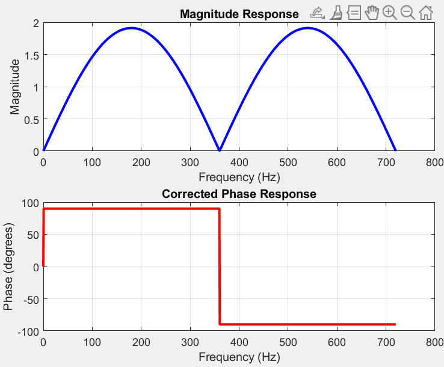
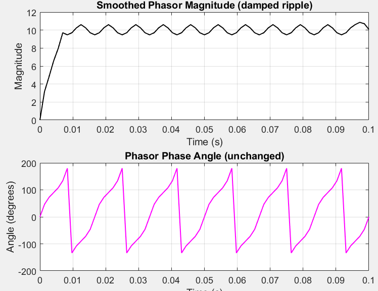
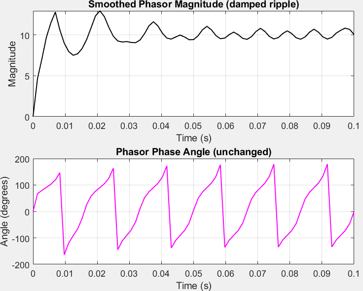

```
fs = 720; % Sampling frequency

T = 1 / fs; % Sampling period

f = linspace(0, fs, 1000); % Frequency range for plotting

omega = 2 * pi * f * T; % Discrete angular frequency (radians/sample)

% Evaluate H(z) = 1.732*z - 2*z^(-1) on the unit circle (z = exp(j*omega))

z = exp(1j * omega);

H = 0.955 * z.^(1) - 0.955 * z.^(-1); % Equivalent to 1.732*z - 2*z^(-1)

% Get magnitude and unwrapped phase

mag = abs(H);

phi = angle(H) * 180 / pi;

% Plot

figure;

subplot(2,1,1);

plot(f, mag, 'b', 'LineWidth', 2);

xlabel('Frequency (Hz)');

ylabel('Magnitude');

title('Magnitude Response');

grid on;

subplot(2,1,2);

plot(f, phi, 'r', 'LineWidth', 2);

xlabel('Frequency (Hz)');

ylabel('Phase (degrees)');

title('Corrected Phase Response');

grid on;
```



```
fs = 720;

T = 1/fs;

t = 0:T:0.1;

f0 = 60;

Vm = 10;

% Original sine wave

x = Vm * sin(2 * pi * f0 * t);

% FIR filter coefficients

b_real = [0.955, 0, -0.955];

b_imag = [1, 0, 1];

a = 1;

% Filter signal

x_real = filter(b_real, a, x);

x_imag = filter(b_imag, a, x);

% Compensate delay (shift left by 1 sample)

x_real = [x_real(2:end), 0];

x_imag = [x_imag(2:end), 0];

% Construct analytic signal

analytic = x_real + 1j * x_imag;

% Compute magnitude and normalize to Vm

mag = abs(analytic);

steady_mag = mean(mag(10:end-10)); % ignore edges for average magnitude

analytic_norm = analytic * (Vm / steady_mag);

% Normalized magnitude

mag_norm = abs(analytic_norm);

% Fix edges

mag_norm(1) = 0;

mag_norm(2) = 0;

mag_norm(3) = 0;

mag_norm(end) = Vm;

% Smooth magnitude to damp ripple (moving average)

window_len = 5; % adjust for smoother or less smooth

mag_smooth = movmean(mag_norm, window_len);

% Reconstruct analytic signal with smoothed magnitude but original phase

analytic_smooth = mag_smooth .* exp(1j * angle(analytic_norm));

% Plot results

figure;

subplot(2,1,1);

plot(t, abs(analytic_smooth), 'k', 'LineWidth', 1);

title('Smoothed Phasor Magnitude (damped ripple)');

xlabel('Time (s)');

ylabel('Magnitude');

grid on;

ylim([0 1.2*Vm]);

subplot(2,1,2);

plot(t, angle(analytic_smooth) * 180/pi, 'm', 'LineWidth', 1);

title('Phasor Phase Angle (unchanged)');

xlabel('Time (s)');

ylabel('Angle (degrees)');

grid on;
```




```
fs = 720;

T = 1/fs;

t = 0:T:0.1;

f0 = 60;

Vm = 10;

A = 5; % Initial DC offset

tau = 0.02; % Time constant of decay (s)

% Generate 60 Hz sine wave input with decaying DC component

x = Vm * sin(2*pi*f0*t) + A * exp(-t / tau);

% FIR filter coefficients

b_real = [0.955, 0, -0.955];

b_imag = [1, 0, 1];

a = 1;

% Filter signal

x_real = filter(b_real, a, x);

x_imag = filter(b_imag, a, x);

% Compensate delay (shift left by 1 sample)

x_real = [x_real(2:end), 0];

x_imag = [x_imag(2:end), 0];

% Construct analytic signal

analytic = x_real + 1j * x_imag;

% Compute magnitude and normalize to Vm

mag = abs(analytic);

steady_mag = mean(mag(10:end-10)); % ignore edges for average magnitude

analytic_norm = analytic * (Vm / steady_mag);

% Normalized magnitude

mag_norm = abs(analytic_norm);

% Fix edges

mag_norm(1) = 0;

mag_norm(2) = 0;

mag_norm(3) = 0;

mag_norm(end) = Vm;

% Smooth magnitude to damp ripple (moving average)

window_len = 5; % adjust for smoother or less smooth

mag_smooth = movmean(mag_norm, window_len);

% Reconstruct analytic signal with smoothed magnitude but original phase

analytic_smooth = mag_smooth .* exp(1j * angle(analytic_norm));

% Plot results

figure;

subplot(2,1,1);

plot(t, abs(analytic_smooth), 'k', 'LineWidth', 1);

title('Smoothed Phasor Magnitude (damped ripple)');

xlabel('Time (s)');

ylabel('Magnitude');

grid on;

ylim([0 1.2*Vm]);

subplot(2,1,2);

plot(t, angle(analytic_smooth) * 180/pi, 'm', 'LineWidth', 1);

title('Phasor Phase Angle (unchanged)');

xlabel('Time (s)');

ylabel('Angle (degrees)');

grid on;
```
