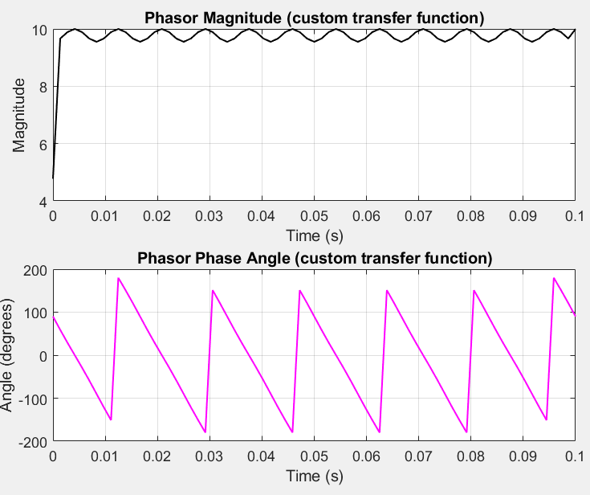
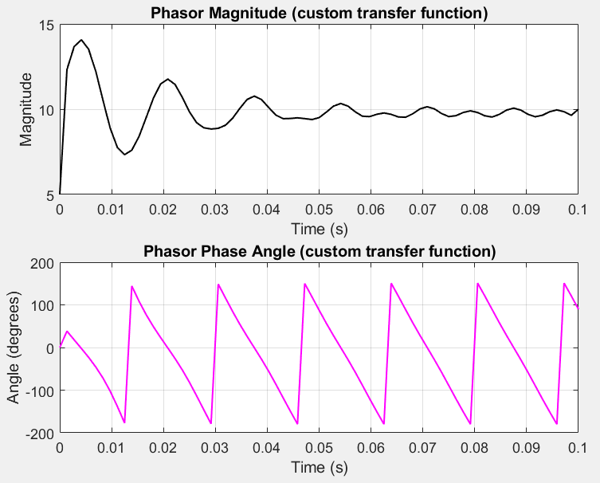

```
fs = 720; % Sampling frequency

T = 1 / fs; % Sampling period

f = linspace(0, fs, 1000); % Frequency range for plotting

omega = 2 * pi * f * T; % Discrete angular frequency (radians/sample)

% Evaluate H(z) = 1.732*z - 2*z^(-1) on the unit circle (z = exp(j*omega))

z = exp(1j * omega);

H = 0.955 * z.^(1) - 0.955 * z.^(-1); % Equivalent to 1.732*z - 2*z^(-1)

% Get magnitude and unwrapped phase

mag = abs(H);

phi = angle(H) * 180 / pi;

% Plot

figure;

subplot(2,1,1);

plot(f, mag, 'b', 'LineWidth', 2);

xlabel('Frequency (Hz)');

ylabel('Magnitude');

title('Magnitude Response');

grid on;

subplot(2,1,2);

plot(f, phi, 'r', 'LineWidth', 2);

xlabel('Frequency (Hz)');

ylabel('Phase (degrees)');

title('Corrected Phase Response');

grid on;
```



```
fs = 720;

T = 1/fs;

t = 0:T:0.1;

f0 = 60;

Vm = 10;

x = Vm * sin(2*pi*f0*t);

% Apply your custom transfer function: 0.955*z^1 - 0.955*z^(-1)

b = [0.955, 0, -0.955]; % z^1 term requires handling (non-causal)

a = 1;

% To simulate z^1, delay output by 1 sample after filtering

x_quad = filter(b, a, x);

x_quad = [x_quad(2:end), Vm]; % Shift left by 1 sample (simulate z^1)

x_quad(1) = 0;

% Form analytic signal

analytic = x + 1j * x_quad;

mag = abs(analytic);

phi = angle(analytic) * 180/pi;

% Plot

figure;

subplot(2,1,1);

plot(t, mag, 'k', 'LineWidth', 1);

title('Phasor Magnitude (custom transfer function)');

xlabel('Time (s)');

ylabel('Magnitude');

grid on;

subplot(2,1,2);

plot(t, phi, 'm', 'LineWidth', 1);

title('Phasor Phase Angle (custom transfer function)');

xlabel('Time (s)');

ylabel('Angle (degrees)');

grid on;
```



```
fs = 720;

T = 1/fs;

t = 0:T:0.1;

f0 = 60;

Vm = 10;

A = 5; % Initial DC offset

tau = 0.02; % Time constant of decay (s)

% Generate 60 Hz sine wave input with decaying DC component

x = Vm * sin(2*pi*f0*t) + A * exp(-t / tau);

% Apply your custom transfer function: 0.955*z^1 - 0.955*z^(-1)

b = [0.955, 0, -0.955]; % z^1 term requires handling (non-causal)

a = 1;

% To simulate z^1, delay output by 1 sample after filtering

x_quad = filter(b, a, x);

x_quad = [x_quad(2:end), Vm]; % Shift left by 1 sample (simulate z^1)

x_quad(1) = 0;

% Form analytic signal

analytic = x + 1j * x_quad;

mag = abs(analytic);

phi = angle(analytic) * 180/pi;

% Plot

figure;

subplot(2,1,1);

plot(t, mag, 'k', 'LineWidth', 1);

title('Phasor Magnitude (custom transfer function)');

xlabel('Time (s)');

ylabel('Magnitude');

grid on;

subplot(2,1,2);

plot(t, phi, 'm', 'LineWidth', 1);

title('Phasor Phase Angle (custom transfer function)');

xlabel('Time (s)');

ylabel('Angle (degrees)');

grid on;
```
