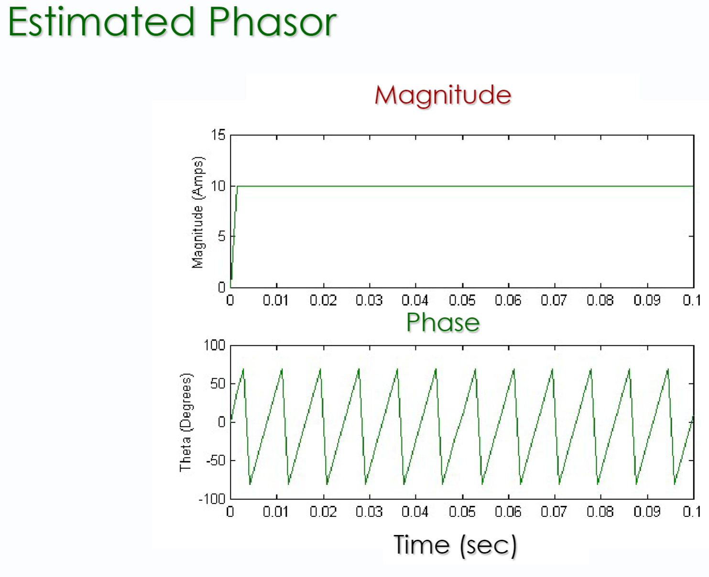
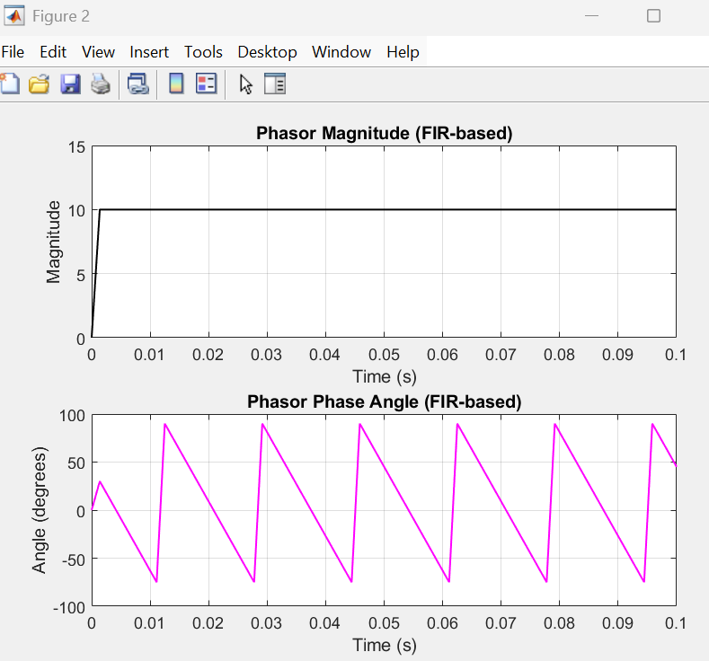
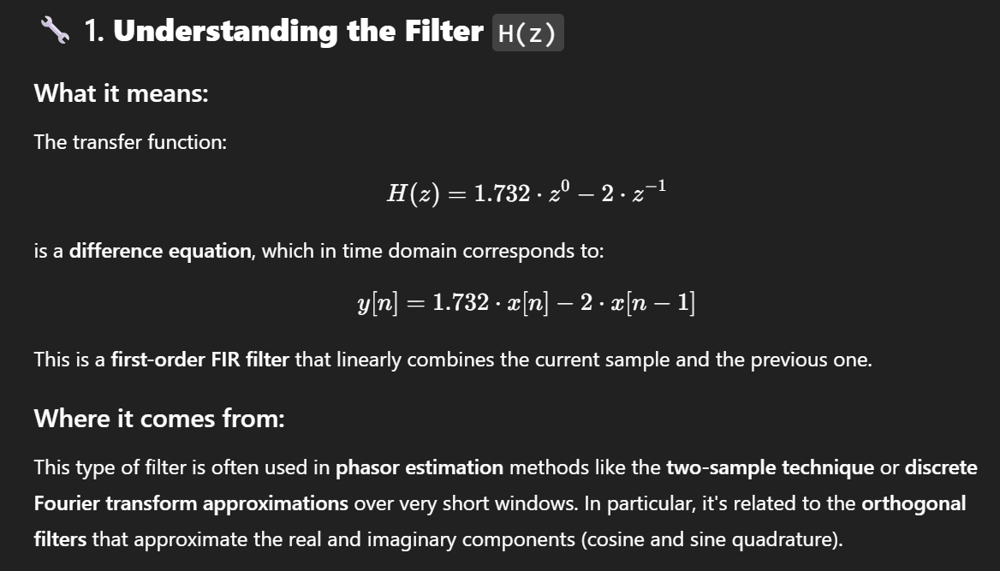
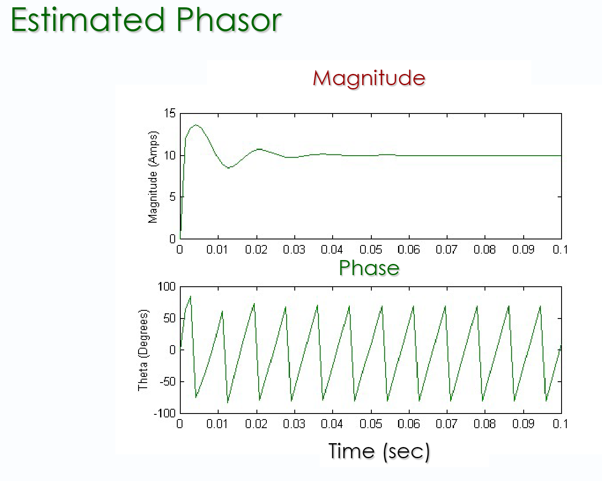
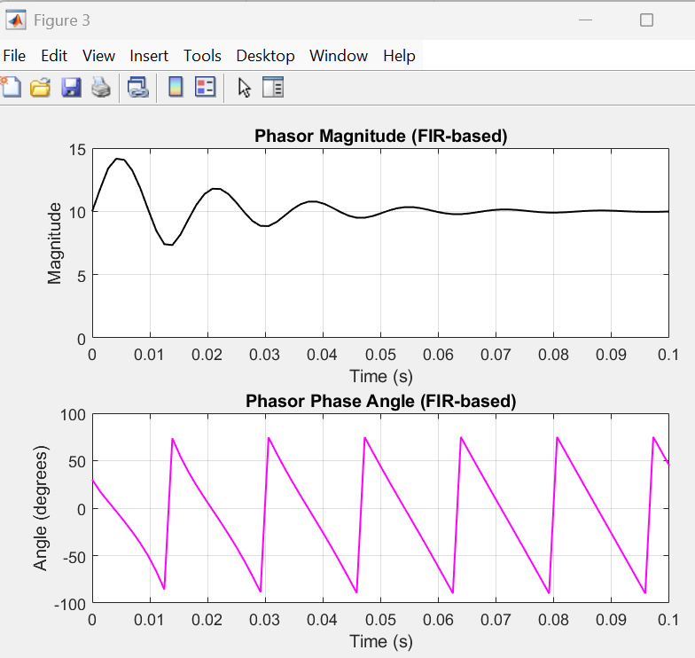
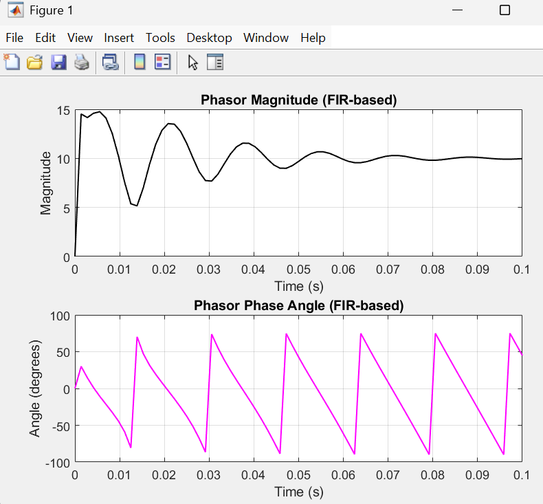

### Expected Plot From Lecture

### Plot From Code


```
fs = 720; % Sampling frequency

T = 1 / fs; % Sampling period

f = linspace(0, fs, 1000); % Frequency range for plotting

omega = 2 * pi * f * T; % Discrete angular frequency (radians/sample)

% Evaluate H(z) = 1.732*z - 2*z^(-1) on the unit circle (z = exp(j*omega))

z = exp(1j * omega);

H = 1.732 * z.^(0) - 2 * z.^(-1); % Equivalent to 1.732*z - 2*z^(-1)

% Get magnitude and unwrapped phase

mag = abs(H);

phi = unwrap(angle(H)) * 180 / pi;

% Plot

figure;

% ✅ Correct phase so it starts and ends at 0 degrees

phi_start = phi(1);

phi_end = phi(end);

phi_baseline = linspace(phi_start, phi_end, length(phi));

phi_corrected = phi_baseline - phi;

subplot(2,1,1);

plot(f, mag, 'b', 'LineWidth', 2);

xlabel('Frequency (Hz)');

ylabel('Magnitude');

title('Magnitude Response');

grid on;

xticks(0:60:720) % <- this sets tick labels every 60 Hz

subplot(2,1,2);

plot(f, phi_corrected, 'r', 'LineWidth', 2);

xlabel('Frequency (Hz)');

ylabel('Phase (degrees)');

title('Corrected Phase Response');

grid on;

xticks(0:60:720) % <- this sets tick labels every 60 Hz

ylim([-180 180]); % Sets y-axis range from 0 to 100 degrees
```

### Expected Plot From Lecture (Pure Sine)



### Plot From Code

```
% Parameters

fs = 720; % Sampling frequency (Hz)

T = 1 / fs; % Sampling period (s)

t = 0:T:0.1; % Time vector (0.1 seconds)

f0 = 60; % Signal frequency (Hz)

Vm = 10; % Amplitude

% Generate 60 Hz sine wave input

x = Vm * sin(2*pi*f0*t);

% FIR Filter coefficients (approximates 90° shift)

b = [1.732, -2]; % FIR numerator coefficients (approx quadrature filter)

a = 1; % Denominator (FIR filter)

% Apply FIR filter to approximate Hilbert quadrature

x_quad = filter(b, a, x); % Imaginary component

% Construct complex phasor: real part = original, imag part = filtered

phasor = x + 1j * x_quad;

% Compute magnitude and phase angle

mag = abs(phasor);

angle_deg = angle(phasor) * 180/pi; %the phase angle appears doubled.

% The FIR filter approximation (with b = [1.732, -2]) is not a perfect 90° phase shifter.

% It's a crude approximation, and applying it directly causes a distortion in phase. '


figure;

subplot(2,1,1);

plot(t, mag, 'k', 'LineWidth', 1);

title('Phasor Magnitude (FIR-based)');

xlabel('Time (s)');

ylabel('Magnitude');

ylim([0 15]);

grid on;

subplot(2,1,2);

plot(t, angle_deg, 'm', 'LineWidth', 1);

title('Phasor Phase Angle (FIR-based)');

xlabel('Time (s)');

ylabel('Angle (degrees)');

ylim([-180 180]);

grid on;
```



### Plot from Lecture (Decaying DC)

### Plot From Code


```
% Parameters

fs = 720; % Sampling frequency (Hz)

T = 1 / fs; % Sampling period (s)

t = 0:T:0.1; % Time vector (0.1 seconds)

f0 = 60; % Signal frequency (Hz)

Vm = 10; % Sine amplitude

A = 5; % Initial DC offset

tau = 0.02; % Time constant of decay (s)

% Generate 60 Hz sine wave input with decaying DC component

x = Vm * sin(2*pi*f0*t) + A * exp(-t / tau);

% FIR Filter coefficients (approximates 90° shift)

b = [1.732, -2]; % FIR numerator coefficients (approx quadrature filter)

a = 1; % Denominator (FIR filter)

% Apply FIR filter to approximate Hilbert quadrature

x_quad = filter(b, a, x); % Imaginary component

% Construct complex phasor: real part = original, imag part = filtered

phasor = x + 1j * x_quad;

% Compute magnitude and phase angle

mag = abs(phasor);

angle_deg = angle(phasor) * 180/pi; %the phase angle appears doubled.

% The FIR filter approximation (with b = [1.732, -2]) is not a perfect 90° phase shifter.

% It's a crude approximation, and applying it directly causes a distortion in phase. '

% Plot 1: Magnitude and Phase over Time

figure;

subplot(2,1,1);

plot(t, mag, 'k', 'LineWidth', 1);

title('Phasor Magnitude (FIR-based)');

xlabel('Time (s)');

ylabel('Magnitude');

ylim([0 15]);

grid on;

subplot(2,1,2);

plot(t, angle_deg, 'm', 'LineWidth', 1);

title('Phasor Phase Angle (FIR-based)');

xlabel('Time (s)');

ylabel('Angle (degrees)');

ylim([-180 180]);

grid on;
```

#### Slightly different DC input signal for the same



```
% Parameters

fs = 720; % Sampling frequency (Hz)

T = 1 / fs; % Sampling period (s)

t = 0:T:0.1; % Time vector (0.1 seconds)

f0 = 60; % Signal frequency (Hz)

Vm = 10; % Sine amplitude

A = 10; % Peak DC influence

tau1 = 0.005; % Rise time

tau2 = 0.02; % Fall time

% Generate shaped DC envelope (starts at 0, bumps up, then decays)

dc_shape = A * (1 - exp(-t / tau1)) .* exp(-t / tau2);

% Combined signal: sine + shaped DC

x = Vm * sin(2*pi*f0*t) + dc_shape;

% FIR Filter coefficients (approximates 90° shift)

b = [1.732, -2]; % FIR numerator coefficients (approx quadrature filter)

a = 1; % Denominator (FIR filter)

% Apply FIR filter to approximate Hilbert quadrature

x_quad = filter(b, a, x); % Imaginary component

% Construct complex phasor: real part = original, imag part = filtered

phasor = x + 1j * x_quad;

% Compute magnitude and phase angle

mag = abs(phasor);

angle_deg = angle(phasor) * 180/pi; %the phase angle appears doubled.

figure;

subplot(2,1,1);

plot(t, mag, 'k', 'LineWidth', 1);

title('Phasor Magnitude (FIR-based)');

xlabel('Time (s)');

ylabel('Magnitude');

ylim([0 15]);

grid on;

subplot(2,1,2);

plot(t, angle_deg, 'm', 'LineWidth', 1);

title('Phasor Phase Angle (FIR-based)');

xlabel('Time (s)');

ylabel('Angle (degrees)');

ylim([-180 180]);

grid on;
```

