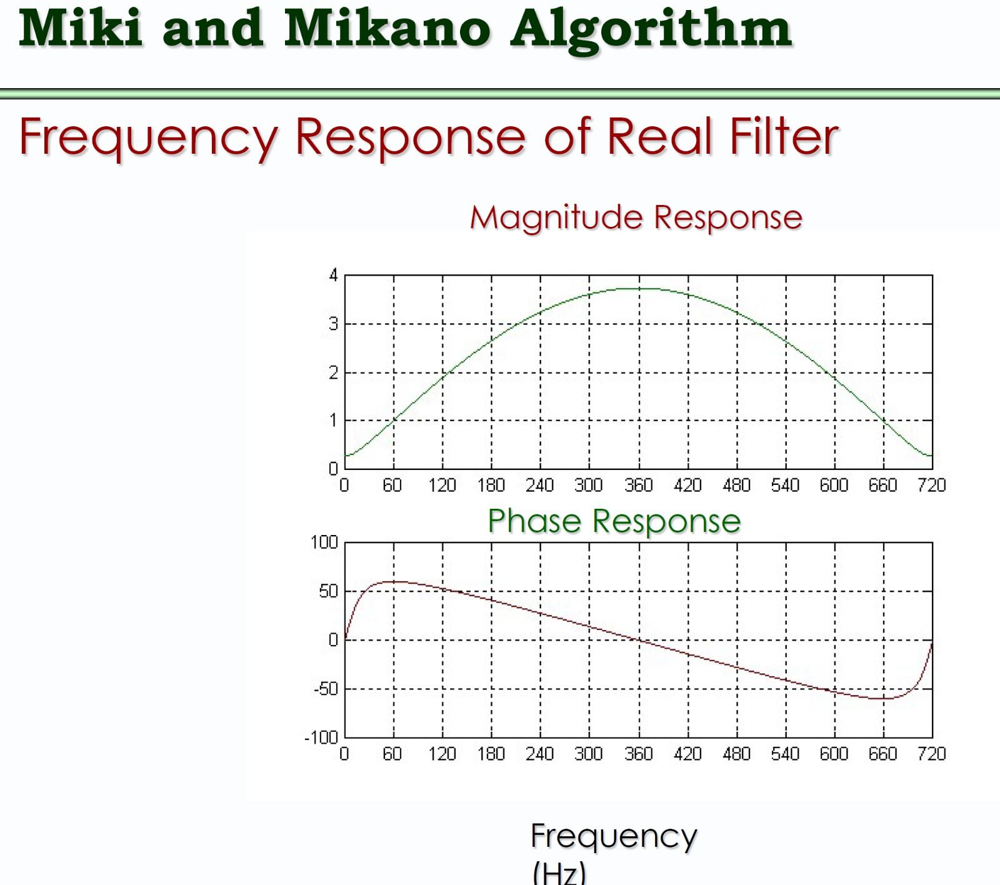
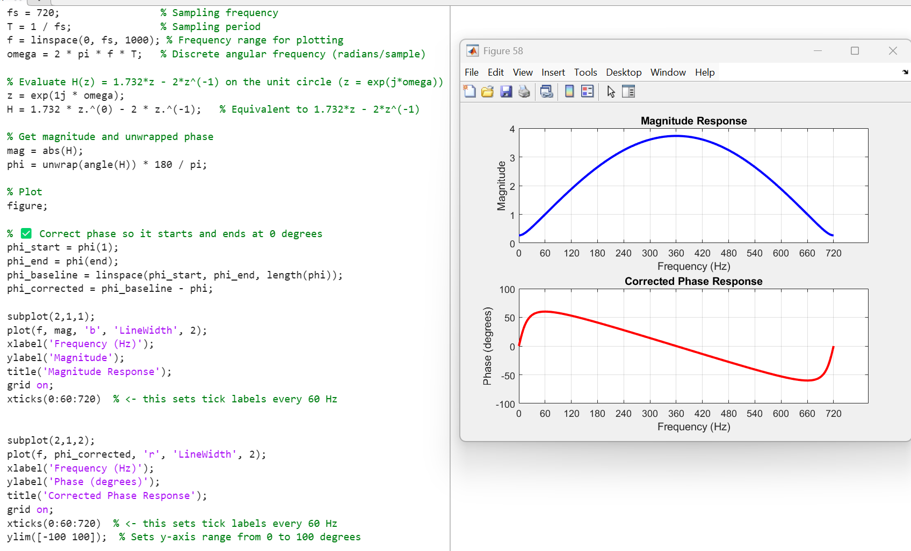

### How to plot magnitude response and phase response on MATLAB


```
fs = 720; % Sampling frequency

T = 1 / fs; % Sampling period

f = linspace(0, fs, 1000); % Frequency range for plotting

omega = 2 * pi * f * T; % Discrete angular frequency (radians/sample)

% Evaluate H(z) = 1.732*z - 2*z^(-1) on the unit circle (z = exp(j*omega))

z = exp(1j * omega);

H = 1.732 * z.^(0) - 2 * z.^(-1); % Equivalent to 1.732*z - 2*z^(-1)

% Get magnitude and unwrapped phase

mag = abs(H);

phi = unwrap(angle(H)) * 180 / pi;

% Plot

figure;

% ✅ Correct phase so it starts and ends at 0 degrees

phi_start = phi(1);

phi_end = phi(end);

phi_baseline = linspace(phi_start, phi_end, length(phi));

phi_corrected = phi_baseline - phi;

subplot(2,1,1);

plot(f, mag, 'b', 'LineWidth', 2);

xlabel('Frequency (Hz)');

ylabel('Magnitude');

title('Magnitude Response');

grid on;

xticks(0:60:720) % <- this sets tick labels every 60 Hz

subplot(2,1,2);

plot(f, phi_corrected, 'r', 'LineWidth', 2);

xlabel('Frequency (Hz)');

ylabel('Phase (degrees)');

title('Corrected Phase Response');

grid on;
<<<<<<< HEAD

xticks(0:60:720) % <- this sets tick labels every 60 Hz

ylim([-100 100]); % Sets y-axis range from 0 to 100 degrees
=======
```

```
fs = 720;                 % Sampling frequency
T = 1 / fs;               % Sampling period
f = linspace(0, fs, 1000); % Frequency range for plotting
omega = 2 * pi * f / fs;   % Discrete angular frequency (radians/sample)

% Evaluate H(z) = 1.732*z - 2*z^(-1) on the unit circle (z = exp(j*omega))
z = exp(1j * omega);
H = 1.732 .* z - 2 ./ z;   % Equivalent to 1.732*z - 2*z^(-1)

% Get magnitude and unwrapped phase
mag = abs(H);
phi = unwrap(angle(H)) * 180 / pi;

% Optional: correct phase trend to make it start/end at 0
p = polyfit(f, phi, 1);
phi_corrected = phi - polyval(p, f);

% Plot
figure;

subplot(2,1,1);
plot(f, mag, 'b', 'LineWidth', 2);
xlabel('Frequency (Hz)');
ylabel('Magnitude');
title('Magnitude Response');
grid on;

subplot(2,1,2);
plot(f, phi_corrected, 'r', 'LineWidth', 2);
xlabel('Frequency (Hz)');
ylabel('Phase (degrees)');
title('Corrected Phase Response');
grid on;

>>>>>>> fe0a447c50abfc5e69685ab29af2da78c1d0bd2e
```