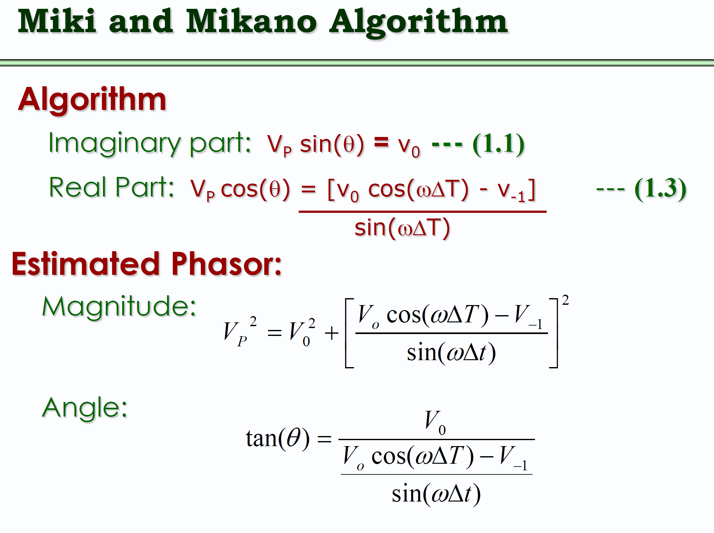

### How to plot magnitude response and phase response on MATLAB

```
fs = 720; % Sampling frequency

T = 1/fs;

n_samples = 2;

delta_T = n_samples * T; % Delta T is the number of samples times T

f = linspace(0, fs, 1000); % Full sweep from 0 to 720 Hz

omega = 2*pi*f*T; % Angular frequency = 2πfT

% Manual frequency response for: H(f) = 1.732 - 2 * e^(j*omega*delta_T)

H = 1.732 - 2 .* exp(j * omega * delta_T);

% Plotting

figure;

subplot(2,1,1);

plot(f, abs(H), 'g', 'LineWidth', 2);

title('Magnitude Response (Real-Part Filter)');

xlabel('Frequency (Hz)');

ylabel('Magnitude');

grid on;

subplot(2,1,2);

plot(f, angle(H)*180/pi, 'r', 'LineWidth', 2);

title('Phase Response (Real-Part Filter)');

xlabel('Frequency (Hz)');

ylabel('Phase (degrees)');

grid on;
```

```
fs = 720;                 % Sampling frequency
T = 1 / fs;               % Sampling period
f = linspace(0, fs, 1000); % Frequency range for plotting
omega = 2 * pi * f / fs;   % Discrete angular frequency (radians/sample)

% Evaluate H(z) = 1.732*z - 2*z^(-1) on the unit circle (z = exp(j*omega))
z = exp(1j * omega);
H = 1.732 .* z - 2 ./ z;   % Equivalent to 1.732*z - 2*z^(-1)

% Get magnitude and unwrapped phase
mag = abs(H);
phi = unwrap(angle(H)) * 180 / pi;

% Optional: correct phase trend to make it start/end at 0
p = polyfit(f, phi, 1);
phi_corrected = phi - polyval(p, f);

% Plot
figure;

subplot(2,1,1);
plot(f, mag, 'b', 'LineWidth', 2);
xlabel('Frequency (Hz)');
ylabel('Magnitude');
title('Magnitude Response');
grid on;

subplot(2,1,2);
plot(f, phi_corrected, 'r', 'LineWidth', 2);
xlabel('Frequency (Hz)');
ylabel('Phase (degrees)');
title('Corrected Phase Response');
grid on;

```