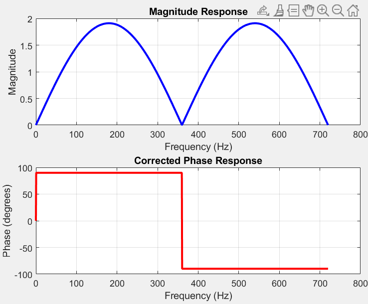

```
fs = 720; % Sampling frequency

T = 1 / fs; % Sampling period

f = linspace(0, fs, 1000); % Frequency range for plotting

omega = 2 * pi * f * T; % Discrete angular frequency (radians/sample)

% Evaluate H(z) = 1.732*z - 2*z^(-1) on the unit circle (z = exp(j*omega))

z = exp(1j * omega);

H = 0.955 * z.^(1) - 0.955 * z.^(-1); % Equivalent to 1.732*z - 2*z^(-1)

% Get magnitude and unwrapped phase

mag = abs(H);

phi = angle(H) * 180 / pi;

% Plot

figure;

subplot(2,1,1);

plot(f, mag, 'b', 'LineWidth', 2);

xlabel('Frequency (Hz)');

ylabel('Magnitude');

title('Magnitude Response');

grid on;

subplot(2,1,2);

plot(f, phi, 'r', 'LineWidth', 2);

xlabel('Frequency (Hz)');

ylabel('Phase (degrees)');

title('Corrected Phase Response');

grid on;
```


```
fs = 720;

T = 1/fs;

t = 0:T:0.1;

f0 = 60;

Vm = 10;

% Original sine wave

x = Vm * sin(2 * pi * f0 * t);

% Define transfer functions

b_real = [0.955, 0, -0.955]; % Real part: H1(z)

b_imag = [3.648, -7.295, 3.648]; % Imaginary part: H2(z)

a = 1; % FIR, so denominator is 1

% Apply filters

x_real = filter(b_real, a, x);

x_imag = filter(b_imag, a, x);

% Align both outputs: causal delay compensation (group delay = 1)

x_real = [x_real(2:end), 0]; % simulate z^1 in H1

x_imag = [x_imag(2:end), 0]; % simulate z^1 in H2

% Construct analytic signal

analytic = x_real + 1j * x_imag;

% Compute magnitude and phase

mag = abs(analytic);

phi = angle(analytic) * 180 / pi;

mag(end) = Vm;

mag(1) = 0;

phi(1) = 0;

% Plot

figure;

subplot(2,1,1);

plot(t, mag, 'k', 'LineWidth', 1);

title('Phasor Magnitude (H1 + H2 filter)');

xlabel('Time (s)');

ylabel('Magnitude');

grid on;

subplot(2,1,2);

plot(t, phi, 'm', 'LineWidth', 1);

title('Phasor Phase Angle (H1 + H2 filter)');

xlabel('Time (s)');

ylabel('Angle (degrees)');

grid on;
```


```
fs = 720;

T = 1/fs;

t = 0:T:0.1;

f0 = 60;

Vm = 10;

A = 5; % Initial DC offset

tau = 0.02; % Time constant of decay (s)

% Generate 60 Hz sine wave input with decaying DC component

x = Vm * sin(2*pi*f0*t) + A * exp(-t / tau);

% Define transfer functions

b_real = [0.955, 0, -0.955]; % Real part: H1(z)

b_imag = [3.648, -7.295, 3.648]; % Imaginary part: H2(z)

a = 1; % FIR, so denominator is 1

% Apply filters

x_real = filter(b_real, a, x);

x_imag = filter(b_imag, a, x);

% Align both outputs: causal delay compensation (group delay = 1)

x_real = [x_real(2:end), 0]; % simulate z^1 in H1

x_imag = [x_imag(2:end), 0]; % simulate z^1 in H2

% Construct analytic signal

analytic = x_real + 1j * x_imag;

% Compute magnitude and phase

mag = abs(analytic);

phi = angle(analytic) * 180 / pi;

mag(end) = Vm;

mag(1) = 0;

phi(1) = 0;

% Plot

figure;

subplot(2,1,1);

plot(t, mag, 'k', 'LineWidth', 1);

title('Phasor Magnitude (H1 + H2 filter)');

xlabel('Time (s)');

ylabel('Magnitude');

grid on;

subplot(2,1,2);

plot(t, phi, 'm', 'LineWidth', 1);

title('Phasor Phase Angle (H1 + H2 filter)');

xlabel('Time (s)');

ylabel('Angle (degrees)');

grid on;
```

