### Generation, Transmission & Distribution

### Generating Station

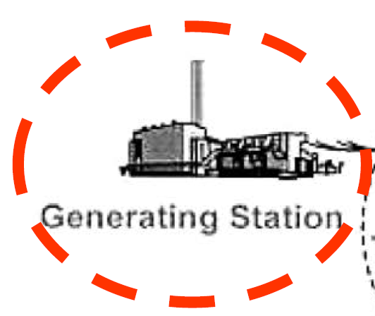

#### Types of generation

- Nuclear Power
- Wind Power
- Water Dam

#### Turbine Generation

- A **majority of power generation** is is converting **mechanical to electrical** energy producing **3 phase AC current**. eg. steam turbines, water turbines, hydro, nuclear, etc.

  - A small percentage is done using **renewable energy** sources like solar, or wind which **either produces DC current or has to be converted to DC first, not AC**.
    - Renewables always produce DC power.
    - It's not simple to switch to it though because the whole system is built in 3 Phase AC systems.
    - **Solar panels**: Naturally produce **DC electricity**.
    - **Wind turbines**: Often produce **variable AC** that is first **converted to DC**, then back to **stable 3-phase AC**.

- **Mechanical energy** gets converted to electrical energy.

  - Thermal (coal, gas, nuclear): Fuel burns or reacts (chemical or nuclear) → generates **heat**. Heat boils water → produces **steam**. Steam spins a **turbine** (mechanical energy). Turbine drives a **generator** → produces **AC electricity**.
  - Water stored in a dam has **gravitational potential energy**. - Falling water spins a **turbine** (mechanical energy). Turbine spins generator → **AC electricity**.
  - Nuclear fission → releases **heat**. Heat creates **steam**. Steam spins **turbine**. Turbine spins generator → **AC electricity**.

- **Generators** are always generating **balanced three phase positive sequence**.

- **Generators** produce a potential difference. Movement of electrons are generated when **potential at one end** is different from the **potential of another**. 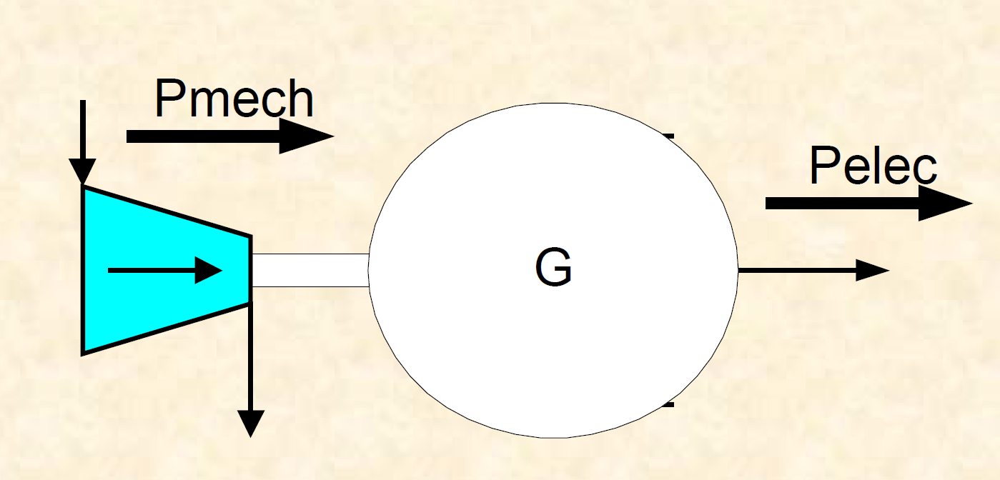
- Generator 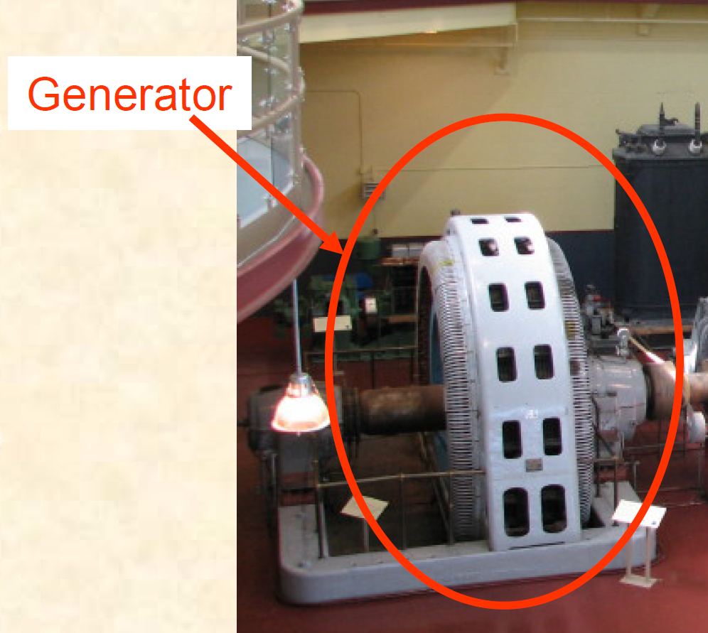
- Turbine 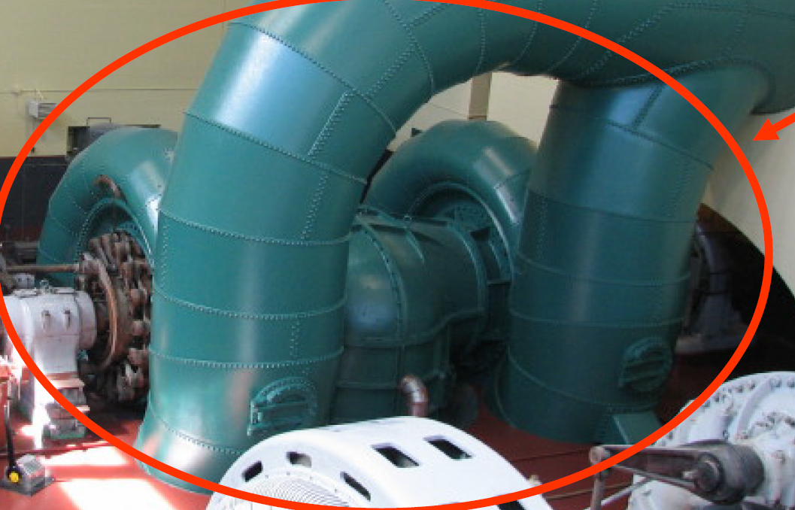
- Power System 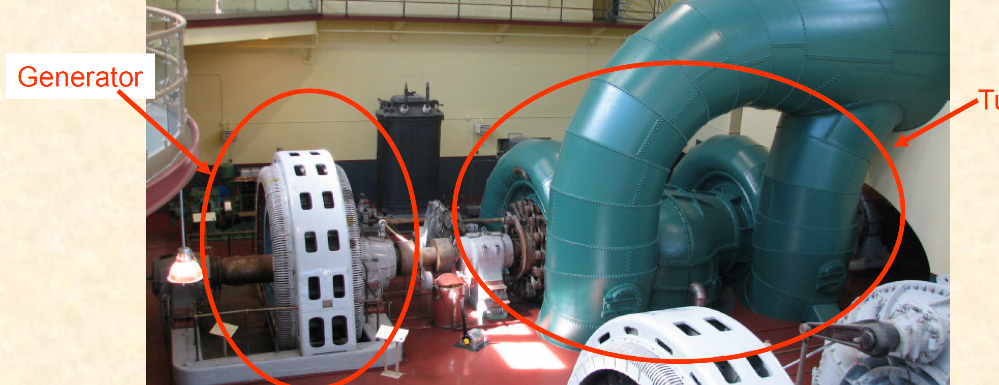

### Three Phase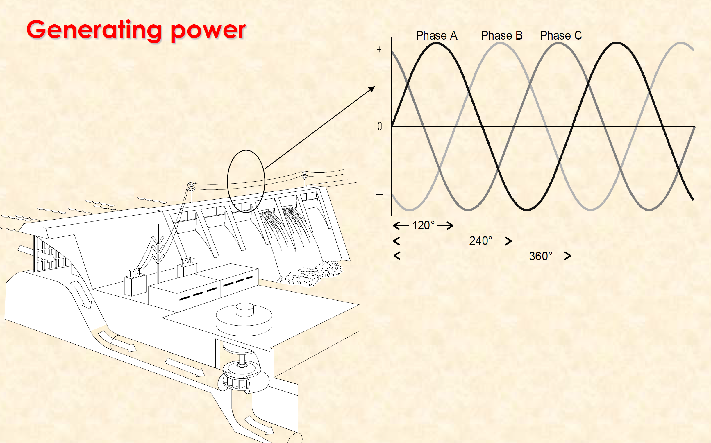

- A **generator** always produces **three alternating currents (phases)**:
  - Each phase is **120° out of phase** with the others. They all have the **same shape and size**, but start **120° apart**:
    - Phase A starts at 0°
    - Phase B starts at 120°
    - Phase C starts at 240°
  - It can go **out of phase due to other reasons** but generator will always generate balanced three phase.
  - This spacing causes the **rotating magnetic field** in motors and keeps power flowing smoothly.
  - Together, they create a **balanced system** (same voltage, same frequency, just phase-shifted).
  - The phases follow the order: **A → B → C** (not A → C → B).
  - This is the **normal rotating magnetic field direction**, used for motors and systems to run correctly.
  - Benefits:
    - **More efficient power transmission** (less wire needed for same power).
    - **Constant power delivery** (single-phase pulses, three-phase is smooth).
    - **Motors run smoother** and more efficiently.

### Transmission System 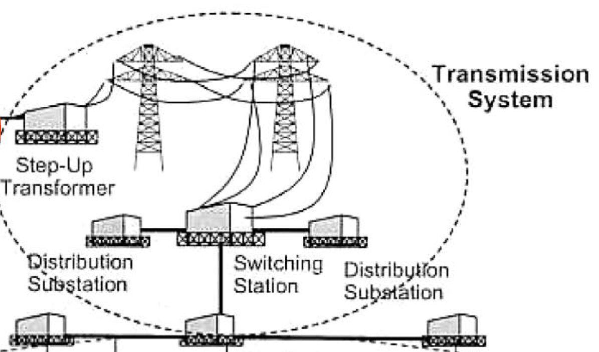

- Generators generally produce **13.8kv to 20kv** range which is not great for transmission due to the enormous loss in energy by the time it reaches its destination.

  - We need to raise the **voltage up to reduce losses**.
  - Using more **winding on the secondary coils of a transformer** we increase the voltage. eg 20kv would lose a lot more compared to 200kv **to reduce losses**. This is called using **step-up transformers**.
  - Use **step-down transformers** to **lower the voltage** at the consumer end (e.g., 230 kV → 11 kV → 240 V for homes).
  - One end might be **three phase 500 kv system transformer** but on the other end, distribution level, we **may use 230 kV system transformer**. 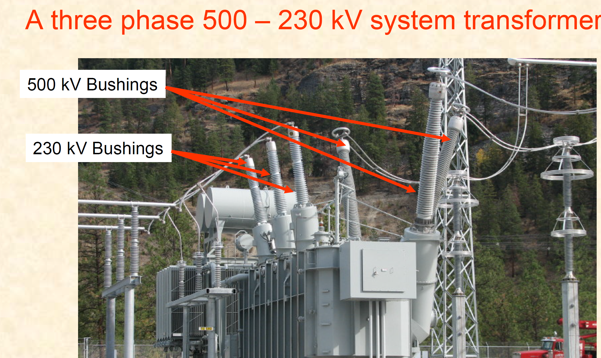
  - At the final step of the power delivery chain a **three-phase distribution transformer setup** converts medium-voltage (25 kV) **down to** low-voltage (416 V) **for industrial or commercial use**. 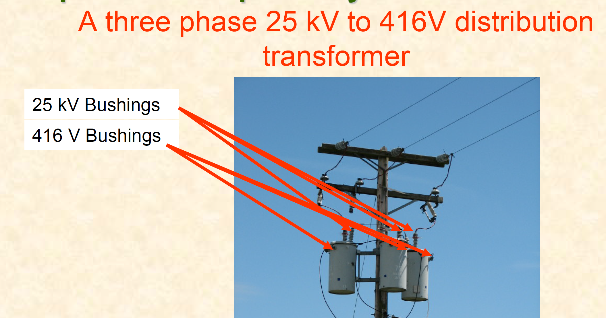
  - **416V** is the 3-phase voltage **between phases**. **240V** is the **usable single-phase voltage** for standard outlets and appliances (from one phase to neutral). 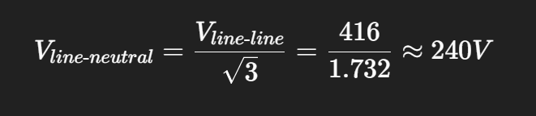
  - **Voltage levels** used for transmission lines in North America typically **range from 60kV to 756kV** where the latter lines are the highest voltage level commonly used for long-distance, high-capacity transmission.
  - In contrast, **Russia** has implemented **1,000 kV (1 MV) transmission lines**, which are higher voltage levels than those found in North America. These ultra-high voltage lines are used for long-distance power transmission across vast territories, which helps to reduce energy losses over long distances.

  - **DC is good for Synchronization**:

    - **AC** systems are harder to synchronize directly because they operate at different frequencies (like 50 Hz or 60 Hz, depending on the region). Each AC system operates independently, and the phases need to be in sync for power transfer, which can be difficult over long distances.
    - **DC lines** offer a solution here because they don't have the frequency issues inherent in AC systems. DC can be used to link two asynchronous AC grids, allowing for easier synchronization and the ability to transfer large amounts of power efficiently, even if the grids aren't running at the same frequency.

  - **Bulk Transmission System**: This refers to systems designed to transport large amounts of electricity over long distances.

    - Power transmission lines are often designed using **bundled conductors**, which means multiple conductors are grouped together in parallel to handle larger amounts of power while minimizing energy loss and improving efficiency. These **bundled conductors might consist of 1, 2, or 4 conductors per phase**, depending on the required power capacity. 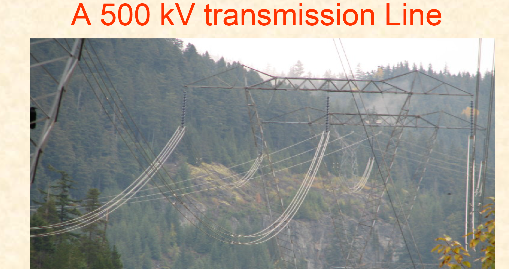
    - The design of these systems is optimized for **high-efficiency transmission over long distances to minimize loss**.

  - **Loop or Meshed System for Reliability**: In order to ensure the **reliability** of the grid, transmission systems are often **looped** or **meshed**.

    - A **loop** means that the transmission system is connected in a circular or semi-circular way, so that if a part of the system fails, power can still be rerouted through another path.
    - A **meshed system** is a more complex network of interconnected transmission lines, which ensures **redundancy**. In case of a fault or failure in one part of the grid, power can be rerouted through another path, avoiding catastrophic failures.
    - **Loss of a single component**, such as a transformer or line, won't necessarily bring down the whole system due to the redundancy built into the system.

  - **Transmission Interconnections Between Neighboring Companies**:

    - **Reinforcement and Reliability**: Transmission lines between neighboring power companies are interconnected to **reinforce** each other. This collaboration improves the overall **reliability** of the grid, as power from one utility can be used to support another in case of unexpected demand or failure.
    - These interconnections allow utilities to **share power** more effectively, making the system more resilient to fluctuations and reducing the chances of local shortages.

  - **Trading Bulk Power**: Interconnections between neighboring transmission networks enable the **trading of bulk power**.

    - Power generation can be located in regions with **abundant resources** (like hydroelectric or wind power), and this power can be transmitted across long distances to areas of high demand.
    - This **market exchange** of electricity also allows for **economic efficiency**, as areas with lower-cost generation can export power to regions with higher demand, optimizing the balance between generation and consumption.

  - **NERC Interconnections**: The **Western**, **Eastern**, and **Texas** grids (or **interconnections**) are large power networks within North America. 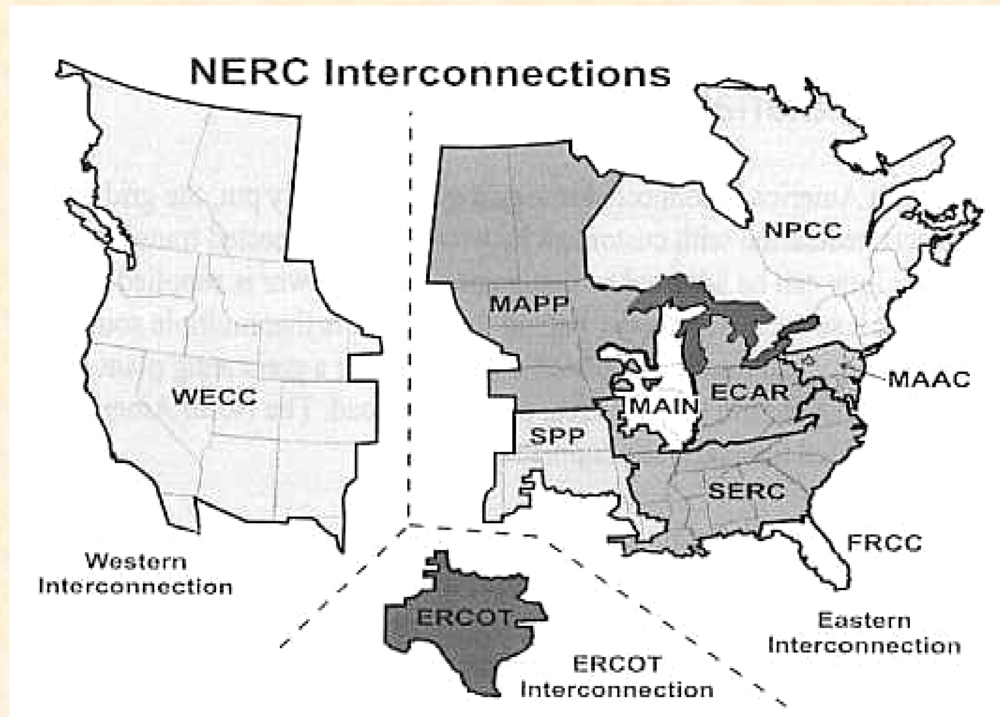
    - **Western Interconnection**: Covers the western part of the United States and parts of Canada.
    - **Eastern Interconnection**: Covers the eastern part of the United States, including most of Canada.
    - **Texas Interconnection (ERCOT)**: Texas has its own isolated grid, managed by ERCOT (Electric Reliability Council of Texas), which is separate from the Western and Eastern interconnections.
  - **NERC (North American Electric Reliability Corporation)**: NERC is responsible for ensuring the reliability of these interconnected grids. It establishes standards and monitors the grid's performance to prevent failures and ensure stability.
  - **NERC Non-Synchronized Systems**: These three regions (Western, Eastern, and Texas) are **not synchronized** with each other. This means their grids run at different frequencies or have slight variations, **making it difficult to directly connect them with traditional AC transmission lines**.
  - **NERC DC Transmission Lines**: To transmit power between these interconnections, **HVDC (High Voltage Direct Current)** transmission lines are used. HVDC is crucial because it allows power to be transferred between these asynchronous grids without the synchronization issues that AC lines would face. DC lines do not depend on the frequency of the grid, allowing efficient and stable interconnection even when the grids are operating independently.

- **Urban Transmission**: In urban areas, **high voltage cables** are typically used for power transmission instead of traditional **overhead lines**.

  - **Why?** Urban environments have limited space and higher population density, so **underground cables** are used to prevent interference with buildings and infrastructure, reduce visual clutter, and minimize the risks of damage from storms or accidents.
  - These underground cables are often more expensive to install and maintain, but they are necessary for urban settings where overhead lines would not be feasible.

- **Stepping Down Voltage for Distribution**: 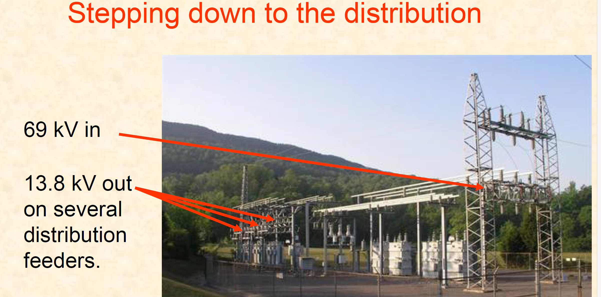
  - **69 kV** is typically the voltage that enters the distribution system from the transmission grid. This high voltage is needed for long-distance transmission to minimize energy losses.
  - **Distribution Voltage**: After entering the distribution system, the voltage is **stepped down** to lower levels for delivery to homes and businesses.
    - The common voltages used for distribution are **20 kV** or **13.8 kV**. These are lower, safer voltages suitable for the final stages of power delivery.
  - **Local Feeds**: Power is then distributed via **several distribution feeds**, often split into smaller networks to serve specific neighborhoods or regions.

### Power Systems Operation

- A **distribution substation** is a critical part of the electrical grid that acts as the intermediary between the **high-voltage transmission network** and the **low-voltage distribution network** that delivers electricity to homes, businesses, and other end users. It is designed to **step down** the voltage from high transmission levels to a lower, usable voltage for distribution to consumers. 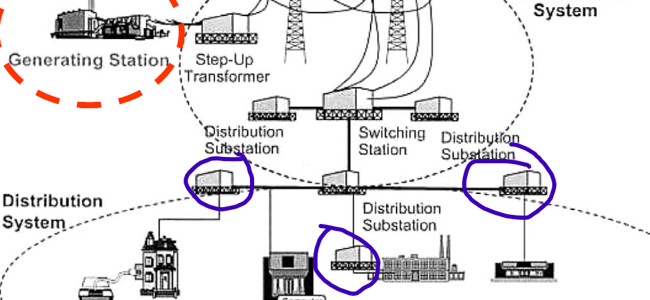
- Distribution substation single line diagram 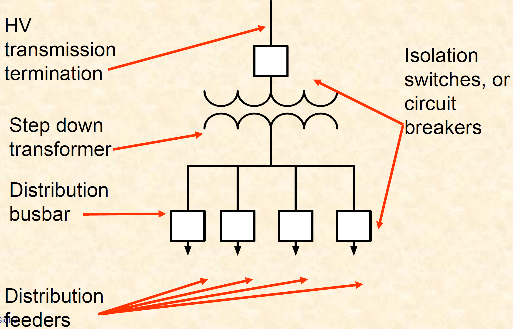

- **Active Power (Real Power)**: This is the power that does the useful work in the system (e.g., turning motors, lighting lamps, etc.). It is measured in watts (W) and is typically represented by **P**.

  - If active power is not balanced with load demand, it can cause frequency fluctuations or even blackouts, as the system's frequency will drift. For example, if generation is too low, the frequency will drop, leading to voltage instability.

- **Reactive Power**: This is the power that supports the electric and magnetic fields in the system, which is necessary for the functioning of certain devices like motors, transformers, and inductive loads. It is measured in **volt-amps reactive (VAR)**, and is represented by **Q**.

  - Reactive power supports the voltage levels required for the system to function properly. If reactive power isn’t properly controlled, it can cause voltage instability, which could lead to equipment damage or voltage collapse in the grid.

- **Matching Power Production to Load Demand**:

  - **Real-time synchronization** of both active and reactive power is critical to prevent imbalances. If the **active power** produced doesn’t match the **active power demand** (load), it can result in **frequency deviations**, leading to power outages, equipment damage, or even blackouts.
  - Similarly, **reactive power** must also be balanced to maintain voltage levels within the required limits. If the reactive power is too high or too low, voltage instability or equipment damage can occur.

- **Accounting for Losses**: Power losses in transmission lines, transformers, and other components also need to be accounted for. The system should generate slightly more power than the demand to make up for these losses, ensuring that the actual power delivered to the load matches the required power.

- **Wicket Gates** are used in **hydroelectric power plants** (and sometimes other types of power plants) to control the flow of water (in the case of hydropower) or steam (in the case of thermal power plants) to the turbines. 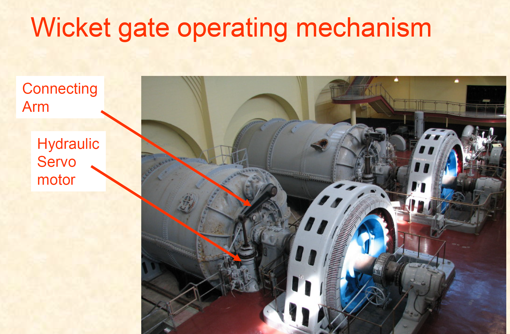

  - **Adjusting Power Generation**: The **wicket gate mechanism** helps regulate the amount of fluid (water or steam) flowing to the turbine, which directly affects the amount of power the turbine produces.
    - When more power is needed, the wicket gates open wider to allow more fluid through, increasing the speed of the turbine and hence the power output.
    - When less power is needed, the wicket gates close, reducing the flow and turbine speed, thus reducing power generation.
  - **Synchronizing with Demand**: The **wicket gate mechanism** allows for quick and fine adjustments in the generation of power to match fluctuating load demands, ensuring that the active power production is synchronized with the real-time demand.

- **Real-Time Monitoring**: It’s crucial to have **real-time measurements** of both active and reactive power at **every point** in the power system. This allows operators to understand the status of the system, detect imbalances, and make adjustments.

  - **Sensors** and **smart meters** are used to monitor voltage, current, frequency, and other system parameters.
  - **SCADA (Supervisory Control and Data Acquisition)** systems help gather data, visualize the power system's status, and allow operators to control equipment in real-time.

- **Automatic Generation Control (AGC)**: This is used to adjust the output of power plants, particularly in the case of **hydropower**, **thermal**, or **gas-fired** plants, to match the system's real-time load demand.

- **Voltage Regulators** and **Reactive Power Compensation Devices**: Devices like **synchronous condensers**, **capacitor banks**, and **reactive power compensators** help manage the reactive power balance.

- **Frequency Control**: When the balance between generation and load is disturbed, the **system frequency** (usually 50 or 60 Hz, depending on the region) will deviate from its nominal value. Power plant operators must adjust generation (through wicket gates, for example) to restore synchronization and bring the frequency back to its nominal value.

- **Grid Synchronization**: To ensure that the power from different generators is synchronized, the system must match both the frequency and phase of the generated power before it’s fed into the grid. In real-time, this is achieved by adjusting **generator outputs** (via wicket gates or other mechanisms) and controlling the timing of power injection into the grid.

- **System Re-Synchronization**: If the power system becomes desynchronized due to disturbances (such as load changes, faults, or other issues), **re-synchronization** has to take place quickly. This involves:

  - Adjusting the output of various generators.
  - Fine-tuning reactive power support.
  - Using **load shedding** (disconnecting non-essential loads) or **generation shedding** (reducing generation) to bring the system back to a stable state.

- **Wicket Gates**: These control how much water flows into the turbine.

  - **Servo motors** move the wicket gates based on the power demand.
  - More water = more turbine speed = more **mechanical power** → more **active (real) power** output.

- **Governors**:

  - These detect changes in system frequency.
  - If frequency drops (load > generation), the governor opens the wicket gates to increase power output.
  - If frequency rises, it closes the gates slightly to reduce output.
  - So: **Governors = active power control = frequency regulation**.

- The **generator field winding or rotor winding** is the **electrically conductive coil** wound on the **rotor** (the rotating part) of a generator or synchronous machine.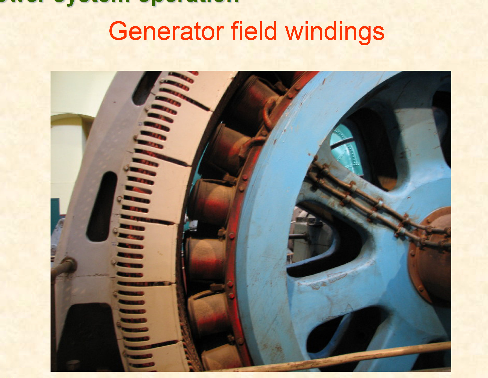

  - Think of the rotor winding as the **magnet-maker**.
  - It turns the rotor into an **electromagnet**.
  - Spinning this electromagnet inside coils (the stator) is how we make electricity.

- **Excitation System**: Supplies DC current to the **rotor winding** of the generator. 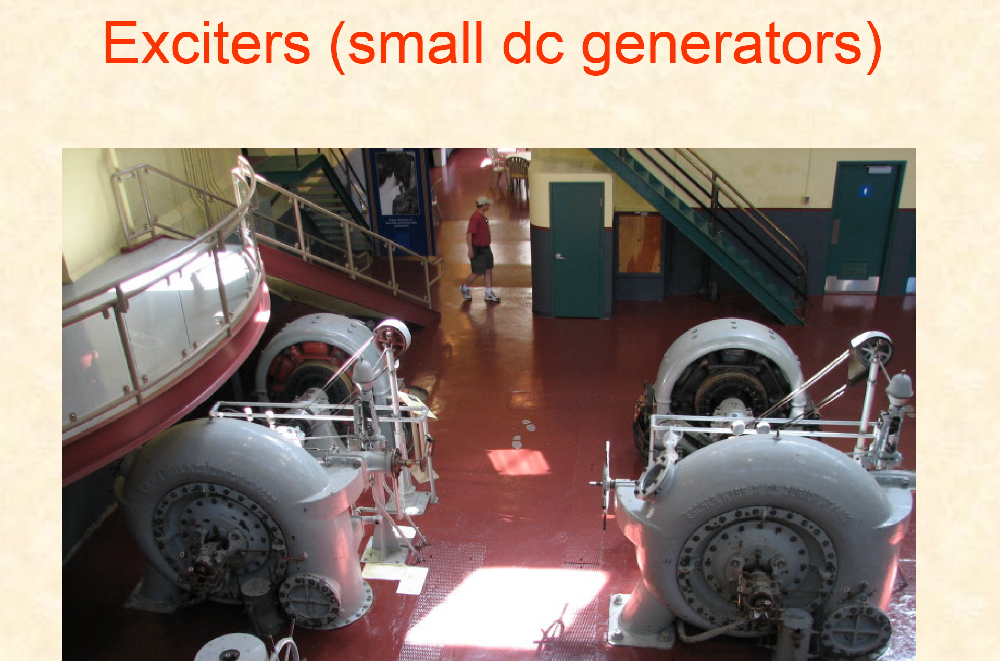

  - The **rotor winding** needs a **DC current** to produce a magnetic field.
  - This magnetic field is what **induces AC voltage** in the stator when the rotor spins.
  - Without excitation, **no voltage** is generated — the machine can't produce power.
  - By increasing or decreasing the excitation current:
    - You **increase or decrease** the magnetic field strength.
    - This adjusts the **terminal voltage** of the generator.
    - Excitation affects the generator’s ability to **supply or absorb reactive power (Q)**.
    - More excitation → more reactive power → **voltage support** to the grid.
    - Less excitation → generator may **absorb** reactive power → **reduces voltage**.

- **Automatic Voltage Regulator (AVR)**: 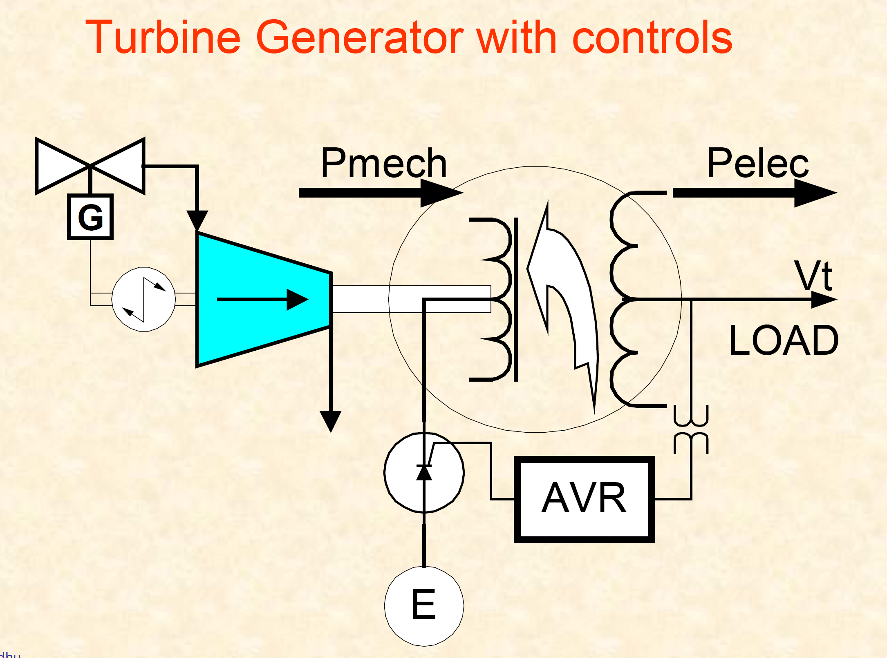

  - Adjusts the **excitation** based on voltage feedback.
  - More excitation → higher rotor magnetic field → higher voltage → **more reactive power** output.
  - Less excitation → lower voltage → less reactive power.
  - So: **AVRs = reactive power control = voltage regulation**.
  - **Automatic Voltage Regulators (AVRs)** control the excitation in real-time.
    - Prevents voltage collapse.
    - Supports **dynamic stability** during faults or load changes.

- **Isolated Generators** are ones that are not connected to the grid: 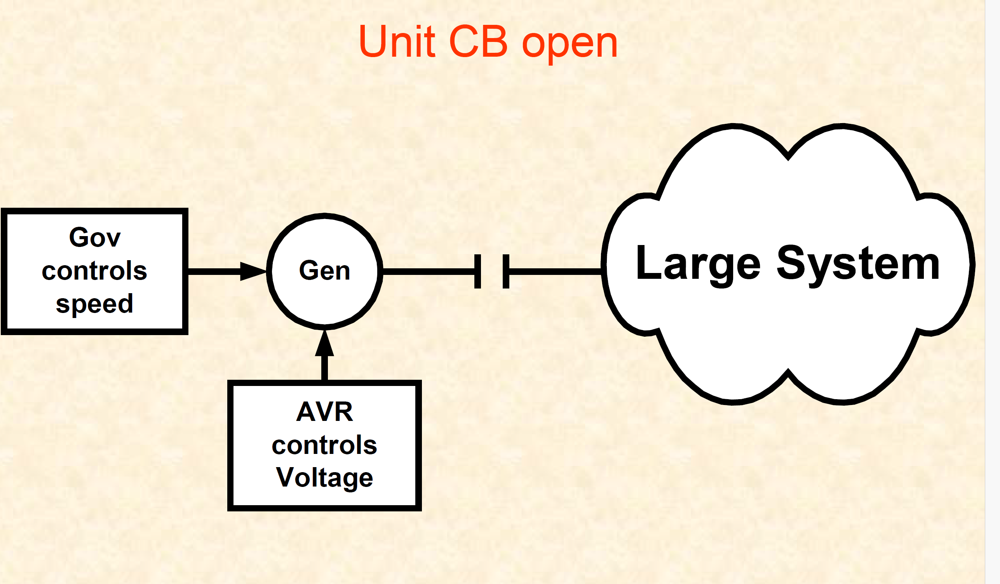

  - **Governor**: Controls **speed** → which directly sets the **frequency**.
  - **AVR**: Controls **voltage** via rotor excitation → manages **reactive power**.

- **Grid connect generators** are ones that are connected to the grid: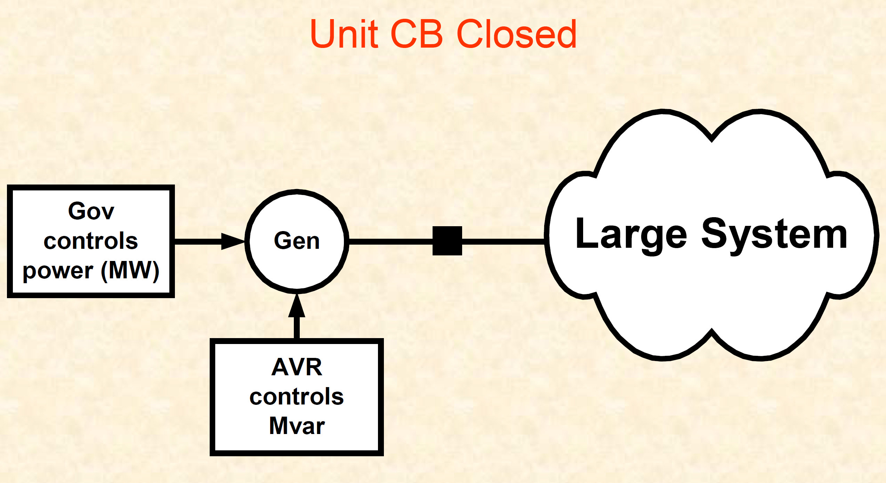

  - Frequency and voltage are set by the **larger power system**.
  - Your generator now behaves like a **slave** to the grid — it must **match** the grid’s frequency and voltage, not set them.
  - Instead of controlling speed or voltage, the generator now:
    - Adjusts **active power** output (by varying mechanical input).
    - Adjusts **reactive power** (via excitation system, still controlled by AVR).

- \*\*Limits of generators: 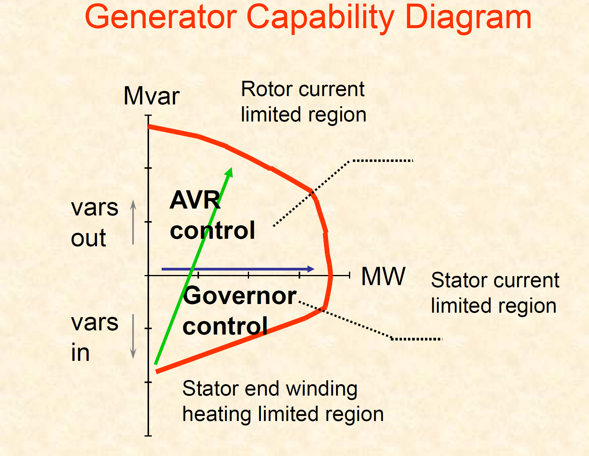

  - Generators can only provide so much active/reactive power before hitting thermal or stability limits.
  - Exceeding these → generator trips → **blackout risk increases**.
  - Protective relays and limiters are in place to prevent damage and maintain system reliability.

- \*\*Frequency vs load balancing:

  - If **generation > load** → **frequency rises** (generators overspeed).
  - If **load > generation** → **frequency drops** (generators slow down).
  - Generators must operate close to **60 Hz** (in North America) — even small deviations can be problematic.

- \*\*Load forecasting

  - Power demand changes **hourly**, **daily**, **seasonally**.
  - Operators predict future loads (e.g., 1 hr ahead, 24 hrs ahead) and schedule generation accordingly.
  - Forecasting ensures enough spinning reserve and avoids overloads or frequency excursions.

- \*\*Reactive power and voltage control

  - Voltage must also remain within tight limits (e.g., ±5%).
  - **AVRs** on generators help supply or absorb reactive power to **stabilize voltage**.
  - **Capacitor banks** and **reactors** are also used at substations and along transmission lines for additional voltage support.

- **If real power load is less than generation, the generators will speed up. Because load is less.**

  - \*\*Real power: Controls the frequency which is indirectly related to the speed. In NA it maintains a freq of 60 Hz. When load and gen match freq is 60hz.

    - \*\*Speed goes down. Frequency goes down as a result.
      - Load: more
      - Generation: less
    - \*\*Speed goes up. Frequency goes up as a result.
      - Load: less
      - Generation: more

  - \*\*Reactive power: Controls the voltage. If load and generation are perfectly matched, the voltage is maintained.
    - Generators produce constant voltage.
    - \*\*If voltage is not enough. Need to generate more reactive power using synchronous condensers or use capacitors (they generate reactive power).
      - Load: more
      - Generation: less
    - \*\*If voltage is too high:
      - Load: less
      - Generation: more
