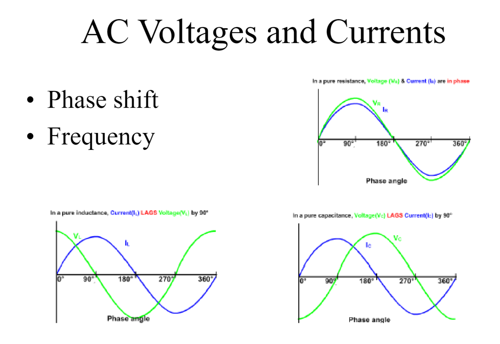
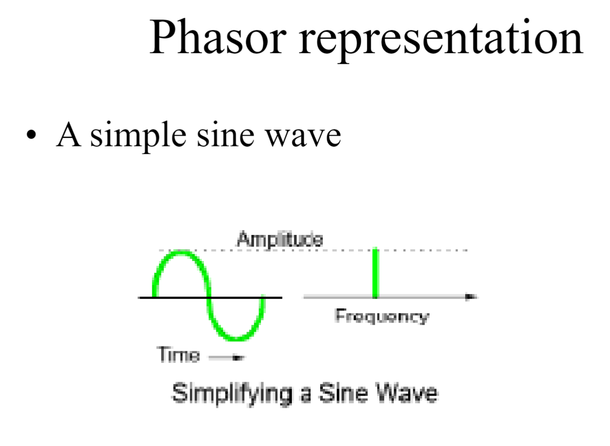
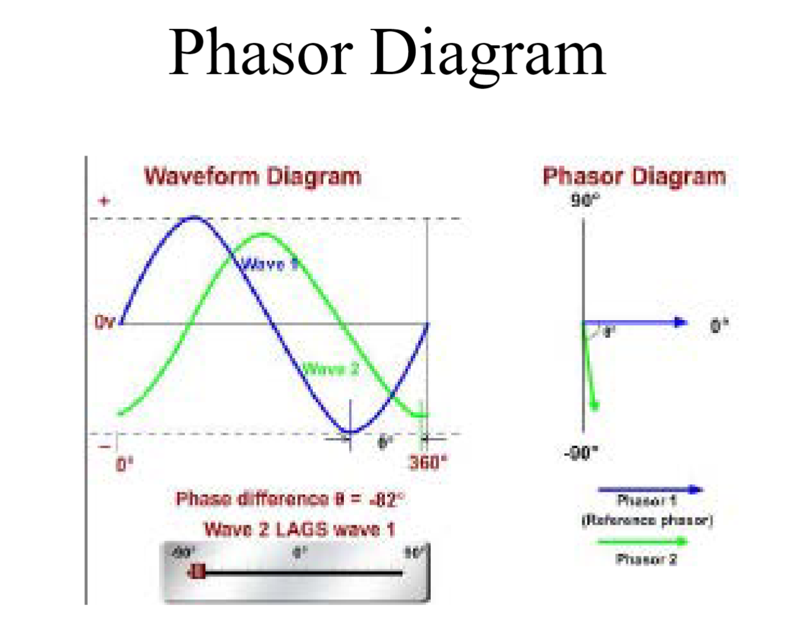
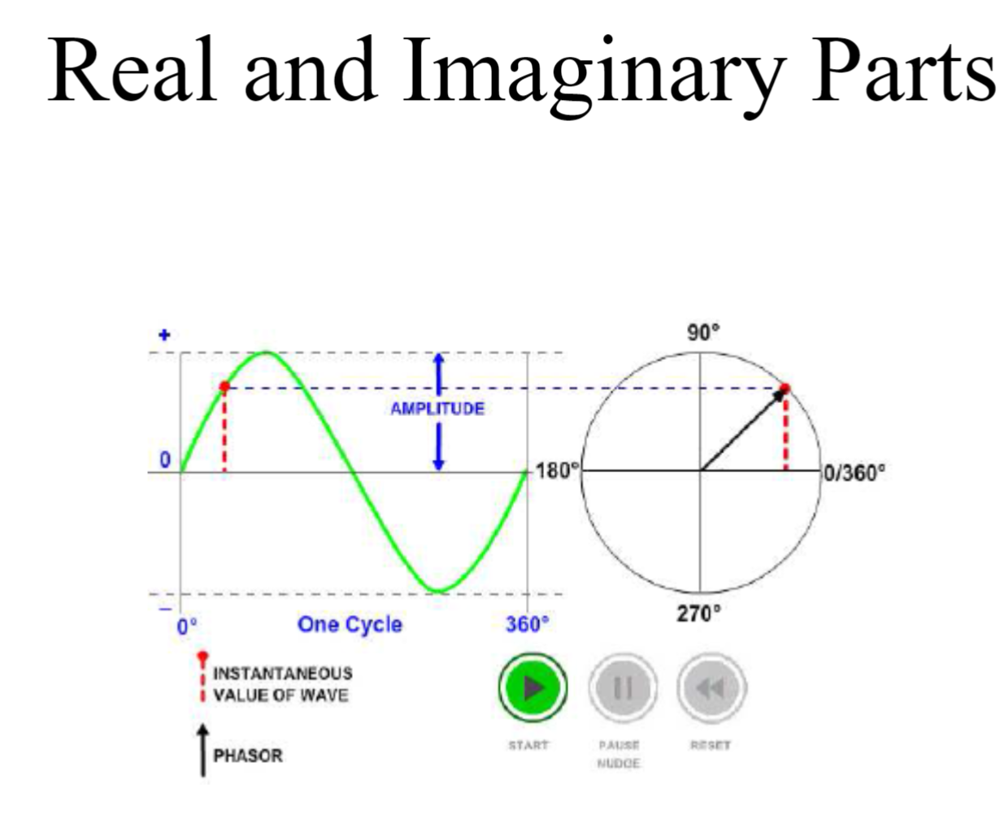
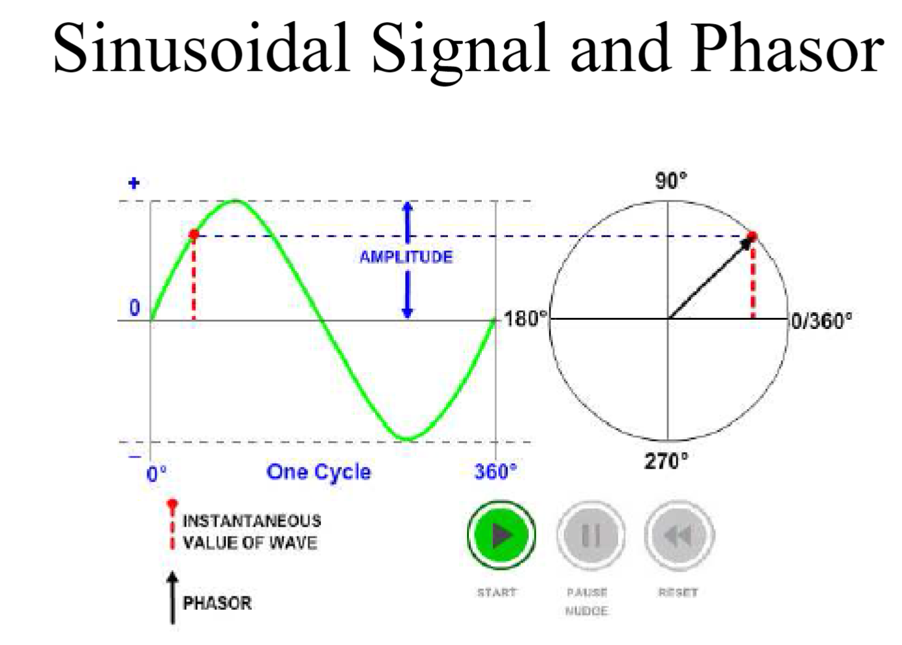

### **Phase Shifting    
### When does the time start?     
 
- The time is arbitrary. We don't know the time. So we assume time to be 0 at a certain point. That's how phasors are defined. The process of moving the window, and phasors are calculated, the phasors rotate. 
- Using phasors is easier because waveforms can added if converted at the same reference.
- What role does frequency play? "Sinusoidal signal and phasor" diagram shows one cycle is 360 deg. So at 0, it is at 0 deg. At 90, it is 90 deg. etc. so as we move along in time, the phasor rotates. The speed of the rotation depends on the frequency. so angular velocity 2 * Pi * f.
- So as long as frequency is constant, 60Hz then they rotate at the same rate as they are sampled over time.

### Learn to do phasor addition/subtraction/multiplication/division
- Addition:
- Subtraction:
- Multiplication:
- Division: